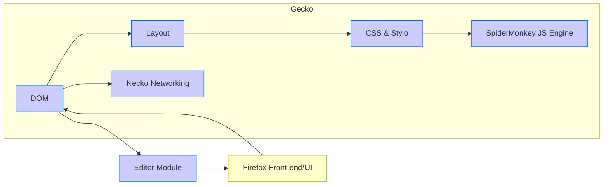

[<< Previous Chapter (Foreword)](./01_foreword.md)

# Chapter 2: Introduction

> **“Mozilla is a living museum of web history, but it’s also the mad science lab forging the web’s future.”**  
> – Some random dev as they scrolled through Bugzilla entries from 1999

## 2.1 Why Firefox? A Brief History of Mozilla

To understand Gecko’s place in the cosmos, we need to journey back through internet history. Imagine the late 1990s: “You’ve Got Mail!” was a catchphrase, HTML `` tags dominated personal websites, and 56k modems serenaded us daily. Netscape Navigator was on the scene, contending with Microsoft’s Internet Explorer in the infamous “browser wars.”

Out of this rivalry, **Mozilla** emerged. Originally, “Mozilla” was the codename for Netscape’s browser project—a playful mash-up of “Mosaic” (the famed early web browser) and “Godzilla” (the giant monster that smashes cities). In 1998, Netscape released its source code to the public, birthing what we now call the Mozilla project. It was a bold experiment in open-source collaboration: “Hey, let’s let the entire planet contribute to our browser code. What could possibly go wrong?”

Fast-forward a few short and tumultuous years, and we have the creation of the **Mozilla Foundation**, a nonprofit dedicated to keeping the internet open, free, and accessible. Through countless rewrites, reorganizations, and late-night debugging sessions, Firefox rose to prominence in the mid-2000s—heralded as the “fast, secure, open” alternative to Internet Explorer. And at the core of Firefox lay its engine: **Gecko**.

## 2.2 Birth of Gecko: A Tale of Code Rewrites

Gecko didn’t spring forth fully formed. Its lineage traces back to the old “NGLayout” engine in Netscape. The dream was to build something modular, robust, and standards-compliant—at a time when “standards” were still a bit Wild West. Over the years, the engine was **substantially rewritten** more than once to incorporate new web standards and new architectural ideas.

- **Early Years (circa 1998–2003)**: The code was influenced by remnants of the old Netscape Communicator suite. Everything was an experiment in progress.  
- **Modernization Era (2004–2010)**: The launch of Firefox brought a focus on performance, security, and more advanced features (like tabbed browsing).  
- **Electrolysis & Beyond (2011–present)**: Multi-process architecture (“e10s”), followed by **Fission**, introduced new ways of isolating tabs and frames for security and performance. Along the way, integrations from the **Servo** project—like **Stylo** (the CSS engine)—have arrived to keep Gecko competitive in the modern web ecosystem.

Understanding these waves of transformation helps you appreciate why you might see function names older than many current contributors, or doc comments referencing an “experiment from 2005.”

## 2.3 The Open-Source Ecosystem: Collaboration at Scale

Mozilla’s open-source nature means that **anyone** can contribute. That sounds amazing in principle, but it also means the codebase reflects the efforts of thousands of volunteers, interns, and staff engineers—each with different styles, preferences, and priorities.

- **Bugzilla**: The main bug tracker, containing tickets from “microscopic CSS glitch” to “re-architect half the browser.”  
- **Phabricator / GitHub**: Code-review systems and front-end mirrors.  
- **Mailing Lists, Forums, Chat**: Official and unofficial channels for discussing features, triaging regressions, or planning future directions.  

From a high-level vantage point, Mozilla’s success with open-source collaboration is a testament to the community’s perseverance. But it also means you’ll sometimes find archaic macros or entire modules in stasis. The reason? Sometimes “it just works” or “nobody dares to touch it.”

## 2.4 Firefox’s Main Ingredients

Let’s demystify the major components that make Firefox tick. If you’re brand-new to web engines, it’s helpful to see how these puzzle pieces fit together before diving deeper.

1. **Gecko**: The web engine core, responsible for parsing HTML/XML, constructing the DOM, applying CSS, orchestrating layout, managing networking, and hooking into JavaScript.  
2. **SpiderMonkey**: The JavaScript engine, integrated into Gecko but large enough to stand on its own (see [Chapter 8](./08_js_spidermonkey.md)).  
3. **Toolkit & Frontend**: Firefox’s user interface (the “chrome”)—historically in XUL, now in more modern web technologies. This includes tab strips, menus, dev tools UI, preferences.  
4. **Rust Components**: Over the last few years, Mozilla has integrated Rust code in places like **Stylo** (CSS), **WebRender** (GPU-based rendering), and more.  
5. **Mobile**: On Android, there’s **GeckoView**, effectively a library embedding Gecko for use in Firefox for Android or third-party apps. iOS is trickier, as Apple mandates WebKit for web rendering, so the Firefox iOS front-end is a custom UI on top of WKWebView.

## 2.5 How to Navigate the Codebase

Before you open your IDE and stare at a million lines of C++ (plus Rust, JavaScript, Python, etc.), take a breath. Here’s a quick guide:

- **mozilla-central**: The primary repository. Think of it as the “source of truth.”  
- **Main Directories**:  
  - `dom/`: DOM implementation, event code, HTML, XML, etc.  
  - `layout/`: The layout engine, frames, reflow.  
  - `js/`: SpiderMonkey.  
  - `netwerk/`: Networking (Necko).  
  - `editor/`: The editor module for text editing, `contentEditable`, etc.  
  - `toolkit/`: Shared libraries, UI components.  
  - `gfx/`: Graphics, plus WebRender integration, Skia, etc.  
  - `media/`: Audio/video handling, WebRTC, codecs.  
  - `modules/`, `extensions/`, `devtools/`, `mobile/`, and more.  

- **mach**: The command-line tool for building, testing, and development tasks. If you’re new, `mach` is your friend.  

## 2.6 The Multi-Process (e10s) Landscape—Leading to Fission

Historically, Firefox was single-process. But that meant a crash or freeze in one tab could take down the entire browser. Electrolysis (e10s) changed that by splitting off content processes from the main (chrome) process. Fission is the next evolution, isolating **cross-origin iframes** into separate processes for enhanced security and performance.

In a typical **Fission** setup:

- **Parent/Chrome Process**: Handles browser UI, privileged tasks, coordinating.  
- **Content Processes**: Each tab or cross-origin group might get its own process.  
- **GPU Process**: Renders/compounds layers for smoother performance.  
- **Socket or RDD Process**: Specialized processes for networking or media decoding (varies by platform).

## 2.7 Standards, Specs, and Why They Matter

Firefox implements a *massive* portion of web standards: HTML, CSS, JavaScript (ECMAScript), DOM APIs, WebAssembly, WebRTC, and so forth. Each specification can run hundreds of pages. The code you see in `dom/`, `layout/`, or `js/` is constantly evolving to match the latest WHATWG or W3C standards, or IETF proposals for networking security. That’s partly why the code never truly “settles”—the web is a living environment.

## 2.8 Why You Need This Context

You might wonder: “Okay, but why do *I* need this historical overview and architecture rundown?” Trust us—knowing the **bigger picture** will make it much easier to debug a random crash in layout or figure out how a single DOM property triggers a chain of reflows. If you see an odd file named `nsIFrameInlines.h`, you’ll recall that `layout/` has a bizarre file structure for frame classes, and it’s all part of Gecko’s rich history.

Similarly, if you want to optimize something in the JavaScript engine, you’ll want to know how **SpiderMonkey** ties into the rest of the platform (especially DOM bindings, as covered in [Chapter 5](./05_dom.md)).

## 2.9 Chapter Roadmap

Moving forward:

1. **[Chapter 3: Getting Started with Gecko](./03_getting_started.md)**  
   You’ll learn about building from source, setting up your environment, dealing with typical pitfalls, and using `mach` effectively.  
2. **[Chapter 4: The Big Picture—Firefox Architecture](./04_architecture.md)**  
   A deeper look at multi-process design (e10s, Fission), how modules like DOM, layout, JS, and networking interrelate.  
3. **[Chapters 5 (DOM)](./05_dom.md)**, **[6 (Layout)](./06_layout.md)**, **[7 (CSS)](./07_css.md)**  
   Detailed dives into DOM internals, layout processes, and CSS style handling.  
4. **[Chapter 8: JavaScript and SpiderMonkey](./08_js_spidermonkey.md)**  
   The engine that runs all that sweet JavaScript.  
5. **[Chapter 9: The Networking Stack](./09_networking.md)**  
   A thorough exploration of Necko, HTTP/2, QUIC, caching, etc.  
6. **[Chapter 10: Editor Module](./10_editor.md)**  
   Deep text-editing functionality, covering contentEditable, IME support, more.  
7. …and so on, ending with future challenges and best practices for large-scale C++.

## 2.10 Quick Mermaid Diagram: The Mozilla Universe

Here’s a simple diagram showing how some major components connect:

## 2.11 Wrapping Up

This **Introduction** is your “You Are Here” sign at the entrance to a very large museum—or maybe a labyrinth. Now you know where Gecko came from, how Firefox is structured, why we have multiple processes, and the general shape of the codebase.

Stay excited: next up is **[Chapter 3: Getting Started with Gecko](./03_getting_started.md)**, where we’ll walk you through **building** the browser, messing with `mach`, and debugging your first pieces of code. If you’re itching to compile, that’s where you’ll want to head next.

---

[Next Chapter >> (Getting Started with Gecko)](./03_getting_started.md)
