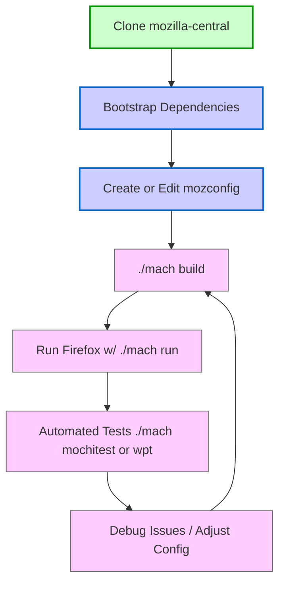

[<< Previous Chapter (Introduction)](./02_introduction.md)

# Chapter 3: Getting Started with Gecko

> **"You never truly know a codebase until you've built it from scratch at least twice—once with the defaults, and once after everything somehow breaks."**  
> – A developer who spent all weekend chasing build errors

## 3.1 Overview

Welcome to **Chapter 3**—the point in your journey where you transition from reading about Firefox and Gecko’s architecture to actually **building** it on your machine. This can be a daunting step. After all, Firefox/Gecko is one of the largest open-source codebases in existence, spanning multiple languages (C++, Rust, JavaScript, Python, etc.) and thousands of submodules.

In this chapter—expanded to be **four times** more detailed—we’ll explore:

1. **Source Code Repositories**: Where the code lives, how to clone, and which branches matter.  
2. **System Requirements**: Ensuring your machine is ready for prime time.  
3. **Bootstrapping**: Using Mozilla’s automated scripts to install build dependencies on various platforms.  
4. **Configuring Your Build**: Editing `mozconfig`, setting up debug or release modes, enabling/disabling features.  
5. **Building with mach**: Key commands, typical build times, plus tips for partial and artifact builds.  
6. **Running and Testing**: How to launch your newly compiled Firefox and run test suites.  
7. **Common Pitfalls**: Frequently encountered errors, weird environment issues, and how to solve them.  
8. **Next Steps**: Integrating with your IDE or editor, submitting your first patch, and references to further docs.

By the end of this chapter, you’ll be able to compile Firefox from source like a seasoned Mozillian (or at least you’ll know where to look when something inevitably goes wrong).

---

## 3.2 Source Code Repositories

### 3.2.1 mozilla-central

The primary repository is **mozilla-central**, often referred to as the trunk. It contains the entire Firefox + Gecko code:

- **Location**:  
  - Mercurial: `https://hg.mozilla.org/mozilla-central/`  
  - Git mirror: `https://github.com/mozilla/gecko-dev` (unofficial but widely used by some developers)
- **Contents**: Core browser code, platform libraries, tests, scripts, front-end UI, etc.  

Many developers prefer cloning from GitHub’s **gecko-dev** mirror for convenience. But official commits land in the **hg** (Mercurial) repository. Patches typically get reviewed via [Phabricator](https://phabricator.services.mozilla.com/) or sometimes via GitHub PR if you coordinate with maintainers.

### 3.2.2 Other Branches

- **mozilla-inbound**: A staging branch for incoming patches that go through the try server and automated tests before merging into mozilla-central.  
- **autoland**: Another integration branch that merges changes once they pass code review and continuous integration.  
- **release & beta branches**: For stabilizing releases, e.g., `mozilla-beta`, `mozilla-release`. Most new development happens in mozilla-central, then merges forward or backward.

If you’re new, **mozilla-central** is where you’ll spend most of your time.

### 3.2.3 Example Commands

Below is an example for **Mercurial**:

```bash
hg clone https://hg.mozilla.org/mozilla-central/
cd mozilla-central
```

Or, for **Git**:

```bash
git clone https://github.com/mozilla/gecko-dev.git
cd gecko-dev
```

Either way, you end up with the same code, though there can be slight differences in branches or commit metadata. The official development flow uses Mercurial, so keep that in mind if you plan to land patches.

---

## 3.3 System Requirements

### 3.3.1 Operating Systems

You can build Firefox on **Linux**, **macOS**, **Windows**, and even on some BSD variants with enough elbow grease. The official supported OS versions can shift over time, but generally:

- **Linux**: A modern distribution (Ubuntu, Fedora, Debian, Arch, etc.) with the usual developer tools (gcc/clang, make, Python 3, etc.).  
- **macOS**: Xcode command-line tools, plus any additional libraries installed via Homebrew or MacPorts.  
- **Windows**: Visual Studio (or Build Tools for Visual Studio), plus appropriate SDKs, and a Python environment. WSL can also work for some tasks, though official instructions vary.

### 3.3.2 Hardware

- **CPU**: At least a multi-core processor. Firefox can stress even high-end CPUs if you do a full build.  
- **RAM**: 8 GB minimum recommended for a debug build, though 16 GB or more is better.  
- **Disk Space**: The cloned repo + build artifacts can easily exceed 40–50 GB. Reserve enough space, especially if you plan multiple build configurations or test directories.

### 3.3.3 Toolchains & Dependencies

When you run the bootstrap script (discussed next), it attempts to install all necessary dependencies—like Python packages, Rust toolchains, node.js (for certain front-end tasks), cbindgen for Rust bindings, etc. On Windows, expect a bigger overhead if you need the full MSVC environment.

---

## 3.4 Bootstrapping with mach

### 3.4.1 The mach Command

Mozilla provides a top-level command-line tool named **`mach`**. It’s effectively a Swiss Army knife for building, testing, linting, debugging, packaging, and more. You’ll see it used constantly throughout your Mozilla development experience.

### 3.4.2 The `./mach bootstrap` Process

Once you’ve cloned mozilla-central, step into that directory and run:

```bash
./mach bootstrap
```

On Linux or macOS, this script attempts to install system packages, configure Rust, set up node, etc., based on your OS. On Windows, it guides you through installing the right Visual Studio components, SDK versions, and Python environment.

**Common tasks** done by bootstrap:

1. Checking for Python 3 version.  
2. Installing or updating Rust (using rustup).  
3. Ensuring Node.js is installed for certain front-end build steps.  
4. Suggesting system packages if you’re missing dependencies (like `libgtk-dev` on Linux).  

Expect to answer a few prompts, especially around which version of Firefox you plan to build: a regular desktop build or possibly Firefox for Android (Fennec).

### 3.4.3 Potential Bootstrapping Issues

- **Permissions**: On Linux/macOS, you might need sudo for system packages.  
- **Corporate Proxies**: If you’re behind a proxy, you’ll need to configure environment variables or the bootstrap script might fail fetching dependencies.  
- **Partial Support**: If you’re on a less common distro or an older OS release, you might have to install some dependencies manually.

---

## 3.5 Configuring Your Build (mozconfig)

### 3.5.1 What Is mozconfig?

Mozilla’s build system reads a file named **`mozconfig`** to determine how you want to build Firefox—debug or release, artifact mode or full compile, etc. Typically, you place a mozconfig in the root of your mozilla-central clone or in `~/.mozbuild/mozconfig`.

Here’s a minimal example:

```bash
# Simple debug mozconfig
ac_add_options --enable-debug
ac_add_options --enable-artifact-builds
mk_add_options AUTOCLOBBER=1
```

### 3.5.2 Common mozconfig Options

1. **`--enable-debug`**: Builds a debug version with extra assertions/logging. Slower but essential for dev work.  
2. **`--enable-optimize`**: Builds optimized code. Typically used for release or performance testing.  
3. **Artifact Builds**: If you only need front-end changes or a faster iteration cycle, artifact builds download precompiled C++ components from Mozilla’s build servers, letting you skip the full compile.  
4. **Language/Locale**: You can specify certain languages or locale packs if needed.  

### 3.5.3 Efficiency Tips

- **Separate objdir**: By default, the build outputs into `obj-<buildtype>`. You can override this with `mk_add_options MOZ_OBJDIR=@TOPSRCDIR@/obj-debug`.  
- **ccache**: Speed up rebuilds by caching compilation results. You can enable it in mozconfig by specifying `ac_add_options --with-ccache`.

---

## 3.6 Building Firefox

### 3.6.1 Full Build

With your environment set and your mozconfig in place, initiate the build:

```bash
./mach build
```

Mach orchestrates the build system (Python-based “mach” scripts, combined with mozbuild, plus generated files). On a **cold build** (no prior caches), expect anywhere from 10–60 minutes or more, depending on your machine specs.

### 3.6.2 Artifact Builds

If you selected **artifact builds** in your mozconfig:

1. **Core** C++ components are downloaded as precompiled artifacts.  
2. You only compile JavaScript, front-end code (some Rust, etc.).  

This drastically reduces build time—often to just a few minutes. The trade-off is that if you need to modify core engine C++ files in `layout/` or `dom/`, you won’t see your changes unless you do a full non-artifact build.

### 3.6.3 Incremental Builds

Mach tries to do **incremental** builds automatically, recompiling only changed files. This usually works well, but large-scale refactoring or certain config changes can cause confusion. If you see weird errors, you may need to do:

```bash
./mach clobber
./mach build
```

Clobbering deletes the `obj` directory, forcing a fresh compile.

---

## 3.7 Running and Testing

### 3.7.1 Launching Your Build

Once the build completes, run:

```bash
./mach run
```

This fires up your newly compiled Firefox. You can pass command-line args like `--profile path/to/profile` or `--devtools` if you want.

### 3.7.2 Test Suites

Mozilla invests heavily in automated tests. Here are the major categories:

1. **Mochitests**: Browser-based tests for DOM, layout, and front-end features.  
2. **xpcshell tests**: Script-based tests running in the minimal XPCOM shell environment.  
3. **Web-platform-tests (WPT)**: Cross-browser tests for standards compliance.  
4. **GTest**: C++ unit tests using Google Test for lower-level engine components.  
5. **Marionette**: WebDriver-based tests for UI and functional flows.

You can run them with commands like:

```bash
# All mochitests:
./mach mochitest

# A specific directory or file:
./mach mochitest dom/tests/mochitest/myTest.html

# Web-platform-tests:
./mach wpt
```

### 3.7.3 Debugging

If you built with **–enable-debug**:

- You’ll see extra assertions or logs in the console.  
- You can attach gdb/lldb to `./mach run`, or set environment variables like `MOZ_LOG=...` for verbose logging.  
- Tools like rr (record & replay debugger) can help with time-travel debugging.

---

## 3.8 Common Pitfalls and Gotchas

1. **Version Mismatch**: On Windows, having multiple Visual Studio versions or mismatched SDKs can lead to perplexing link errors. Check your environment carefully.  
2. **Python Path Confusion**: Some systems have multiple Python installations. If `mach` picks the wrong one, you’ll get import or syntax errors. The bootstrap script typically resolves this, but keep an eye out.  
3. **Wrong mozconfig**: A single stray character (like `ac_add_options –enable-debug` with a non-ASCII dash) can produce cryptic parse errors. Double-check your mozconfig if the build system complains unexpectedly.  
4. **Running Out of Disk Space**: Large debug builds can exceed tens of gigabytes. If you’re on a smaller SSD, watch your free space.  
5. **Clobber Necessity**: If you drastically change your configuration, you might need a full `./mach clobber`. Otherwise, incremental builds could fail with odd missing symbols.  
6. **Slow Builds**: If your machine is older or you’re on a laptop, consider artifact builds. Or upgrade your RAM—this codebase is massive.

---

## 3.9 Tools to Make Your Life Easier

### 3.9.1 IDE Integration

- **Visual Studio Code** or **CLion**: Often used with custom tasks or CMake-based indexing. Because Mozilla uses its own build system, you might need to generate compile_commands.json to have full IntelliSense support.  
- **Eclipse, NetBeans, Qt Creator**: Less common these days, but some folks still use them.  
- **Rust Analyzer**: If you’re hacking on Rust components (WebRender, Stylo), a dedicated Rust plugin helps with autocompletion.

### 3.9.2 `mach doctor`

```bash
./mach doctor
```

This command checks for common system issues—like out-of-date Rust, missing ccache config, or suspicious environment variables. It’s not a cure-all, but can highlight glaring misconfigurations.

### 3.9.3 Build Profiler

Mozilla occasionally offers build profiling, which shows which steps or directories consume the most compile time. This can guide you on distributing your build across multiple cores or adjusting ccache usage.

---

## 3.10 A Quick Mermaid Diagram: Build & Test Flow

Here’s a simplified flowchart of how code goes from clone to test:



---

## 3.11 Beyond the Basics: Next Steps

After you’ve built and run a local copy of Firefox, you might wonder, “What’s next?”

- **Dive Deeper into Architecture**: Check out [Chapter 4](./04_architecture.md) to see how multi-process e10s and Fission components coordinate.  
- **Code Exploration**: Start reading code in `dom/`, `layout/`, or `js/` if you have a feature or bug in mind.  
- **Filing Your First Bug**: If you encounter a crash or an obvious glitch, see how to file a bug in Bugzilla.  
- **Get a Mentor**: Mozilla folks are generally friendly. Consider the `#introduction` or `#developers` channels on Matrix/IRC to ask for guidance.

---

## 3.12 Summary

In this deep dive, we’ve covered:

1. **Where to clone** mozilla-central, how branches function, and why you’ll probably use mozilla-central the most.  
2. **System setup**: OS versions, hardware, toolchains, Python, Rust, and everything the bootstrap script tries to do for you.  
3. **mozconfig**: A crucial piece for customizing builds—debug, release, artifact, ccache, etc.  
4. **Building** with `mach build`, plus incremental and artifact strategies.  
5. **Running & Testing**: Launching your built Firefox, running mochitests, xpcshell tests, or web-platform-tests.  
6. **Common Pitfalls**: From environment mismatches to disk space woes.  
7. **Helpful Tools**: IDE integration, `mach doctor`, build profiling.  

At this point, you should have a working local build environment or at least know how to set one up. The key is to remain patient—building Firefox is not as straightforward as smaller projects. But once you have it, you’re ready to **contribute** patches, explore advanced features, and truly understand the code you’re reading in later chapters.

---

[Next Chapter >> (The Big Picture: Firefox Architecture)](./04_architecture.md)
