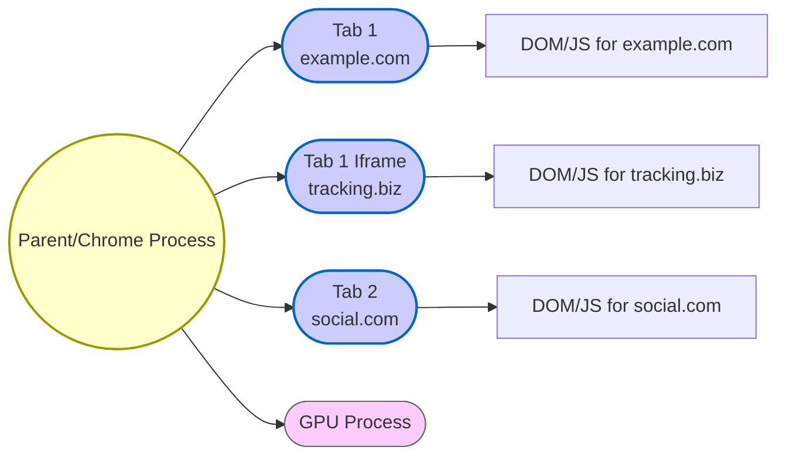
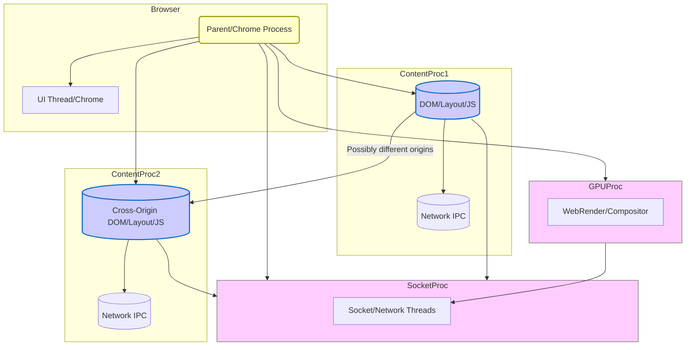

[<< Previous Chapter (Getting Started with Gecko)](./03_getting_started.md)

# Chapter 4: The Big Picture: Firefox Architecture

> **“A browser is like a city—many districts with unique functions, all needing to cooperate without crashing into each other.”**  
> — A lead engineer explaining multi-process to new hires

## 4.1 Overview

Now that you can **build** Firefox on your machine (as described in [Chapter 3](./03_getting_started.md)), let’s explore **how** Firefox is architected internally. Firefox is more than just a single executable: it’s a **multi-process** system where different tasks (the browser UI, page content, GPU compositing, networking) can run in separate processes for stability, security, and performance.

We’ll place special emphasis on **Fission**, the next evolution of multi-process design that isolates **cross-origin iframes** into their own processes for security and privacy. By the end of this chapter, you’ll understand:

1. **Why multi-process?** The move from single-process to e10s (Electrolysis) and beyond.  
2. **High-level architecture**: Parent process, content processes, GPU process, and more.  
3. **Fission**: The motivations, the site-isolation concept, and how it’s implemented in Gecko.  
4. **Inter-process communication (IPC)** and how the pieces coordinate.  
5. **Performance & security implications** of this design.  
6. **Debugging tips** for multi-process issues.

Let’s dive in.

---

## 4.2 The Single-Process Past

In the **pre-Firefox 4** era, the browser ran mostly as one big process. While simpler to develop, it had major drawbacks:

- **Crashes**: If a single webpage triggered a crash (e.g., a misbehaving plugin), it took down the entire browser.  
- **Responsiveness**: Heavy scripts or slow network tasks could block the UI thread, making the browser unresponsive.  
- **Security**: An exploit in one site’s JavaScript could theoretically access data from other tabs since everything lived in the same memory space.  

Other browsers (like Chrome) had begun exploring site isolation or multi-process for each tab, raising user expectations for stability. Mozilla recognized the need for **Electrolysis** (e10s).

---

## 4.3 Electrolysis (e10s): The Multi-Process Foundation

### 4.3.1 The Goal

**Electrolysis** (e10s) introduced a **parent (chrome) process** for the browser UI and multiple **content processes** for tabs. The impetus:

1. **Security**: Isolate web content so an exploit can’t access privileged UI data.  
2. **Stability**: One tab’s crash doesn’t bring down the entire browser.  
3. **Performance**: Leverage multiple CPU cores by distributing workloads across processes.

### 4.3.2 Basic Layout

Typically:

- **Chrome (Parent) Process**:  
  - Handles browser UI: tab strips, menus, preferences.  
  - Manages top-level decisions: scheduling, updates, collecting telemetry.  
  - Allocates resources for child processes.

- **Content Processes**:  
  - Each tab (or set of tabs) runs web content: DOM, layout, JavaScript, etc.  
  - If a website or script crashes here, the parent can recover gracefully.  

Later, **additional processes** were added for specialized tasks:

- **GPU Process**: Handling compositing and graphics on modern hardware, preventing driver crashes from killing the main UI.  
- **RDD (Remote Data Decoder) Process**: On some platforms, used for media decoding or sandboxing.  
- **Socket Process**: In certain configurations, handles networking in a separate process.

Even with e10s, however, a single content process might still host multiple **origins**. If one malicious site or large script spiked CPU usage, it could impact unrelated sites in that same process. That’s where **Fission** comes in.

---

## 4.4 Fission: Taking Site Isolation to the Next Level

> **“Fission is e10s 2.0—true site isolation across different origins, iframes, and tricky web APIs.”**

### 4.4.1 The Motivation

Modern webpages are rarely just a single domain. They embed iframes, ads, analytics scripts, social media widgets, and more from **multiple** origins. Under traditional e10s, all frames in a tab might share the same process—even if those frames came from completely different domains. This poses risks:

1. **Security**: A malicious iframe from `evil.com` might exploit a memory bug to read data from `mybank.com` if they share a process.  
2. **Privacy**: Cross-origin data leaks or advanced side-channel attacks become easier if everything shares the same address space.  
3. **Stability**: A heavily scripted ad iframe could degrade performance for the entire tab’s content.

**Fission** addresses this by isolating each **site** (or set of related sites) in its own process. If your main document is from `example.com`, but it embeds an iframe from `tracking.biz`, that iframe might run in a **different** content process. This **true site isolation** drastically reduces the blast radius of exploits and improves overall reliability.

### 4.4.2 Conceptual Diagram

Let’s illustrate Fission with a diagram:

In this hypothetical scenario:

- **Tab 1** is an `example.com` top-level doc running in Content Process #1, while its `tracking.biz` iframe might run in Content Process #2.  
- **Tab 2** has a main doc from `social.com`, running in Content Process #3.  
- The **Parent** manages these processes, coordinates them, and shares with the **GPU Process** for final compositing.

---

## 4.5 Fission Under the Hood

### 4.5.1 BrowsingContext & IPDL Actors

Fission introduces new data structures and IPDL (IPC Definition Language) actors:

- **BrowsingContext**: A new abstraction representing a “browsing context” (top-level window or iframe). Each context can be hosted in a different process.  
- **WindowGlobalParent / WindowGlobalChild**: Actors bridging parent and child processes for a single window or iframe’s global object.  
- **Cross-Process Navigation**: If you navigate from `example.com` to `bank.com`, Firefox checks if `bank.com` should be in the same process or a different one. Then it spawns or reuses another content process, transferring the browsing context if needed.

### 4.5.2 Performance Implications

Running **more processes** means more overhead in terms of memory usage and inter-process communication (IPC). Fission tries to be **smart** about process allocation: it won’t spawn a separate process for every single resource. Instead, it **groups** same-origin frames together and imposes a limit on total processes. This is a balancing act:

- **Security/Isolation** vs. **Memory/IPC Overhead**.  
- The user’s machine may only handle so many processes before thrashing.

### 4.5.3 Handling Cross-Origin Iframes

Under Fission, each **iframe** from a different origin can be placed in a separate content process. The top-level document and the cross-origin iframe communicate via **IPC** calls rather than direct memory references. This removes shared address-space vulnerabilities but means more complexity in coordinating events, DOM access, and focus or drag-and-drop interactions across processes.

### 4.5.4 Shadow Realms & Cross-Document Communication

While the user sees a single page, behind the scenes, the page might be rendered by multiple processes. The DOM or devtools might create illusions of a single DOM tree, but events or script calls bridging origins must go through messaging channels. Fission’s architecture ensures any cross-origin operation is carefully validated to prevent security holes.

---

## 4.6 Overall Multi-Process Components

Even before Fission, Firefox had multiple specialized processes. Now they all mesh together:

1. **Parent (Chrome) Process**  
   - The main UI, privileged code, controls child process lifecycles.  
2. **Content Processes**  
   - Each tab or cross-origin group runs web code: DOM, layout, CSS, JS execution.  
3. **GPU Process**  
   - Offloads compositing, WebRender tasks to GPU for better stability/performance.  
4. **RDD/Socket Processes**  
   - Media decoding or networking can run in separate processes. On some systems, these might be combined with content or parent, depending on build config.

**Fission** extends the content processes so that **multiple** distinct processes might be used in a single tab if it has cross-origin frames.

---

## 4.7 Why Multi-Process Matters

### 4.7.1 Security

**Site isolation** means a compromised site can’t easily read memory from another site. Memory pointers in one process can’t magically access address space in another. Combined with sandboxing, it makes it far harder for an exploit to escalate privileges or steal data from other tabs.

### 4.7.2 Stability

If a content process crashes, the tab can reload or show a “tab crashed” page, but the rest of the browser keeps running. With Fission, even if a cross-origin iframe crashes, only that frame might need reloading. Meanwhile, the main doc or other frames remain alive.

### 4.7.3 Performance

- **Parallelization**: Multiple CPU cores can handle different processes simultaneously.  
- **UI Responsiveness**: The parent process handles UI events, so a heavy script in a content process won’t freeze the browser chrome.  
- **Caveats**: More processes can increase memory usage. Also, cross-process messaging overhead can matter for large data transfers or frequent DOM updates that need bridging.

---

## 4.8 IPC (Inter-Process Communication)

### 4.8.1 IPDL and Actors

Firefox uses **IPDL** (Inter-Process Communication Definition Language) to define “actors” that pass messages between processes. Each actor has a parent side (in the parent process or a controlling content process) and a child side (in the process that handles the actual logic).

**Common examples**:

- **PBrowser**: Manages tabs or top-level windows, hooking them into the parent process.  
- **PContent**: General actor for system messages, data passes.  
- **PWindowGlobal**: For a single window or iframe global, especially in Fission.  

Each message is defined in `.ipdl` files, compiled into C++ stubs that handle marshalling data.

### 4.8.2 Message Flow Examples

- **DOM Event** in an iframe: Possibly must bubble up to the parent doc. Under Fission, this might cross process boundaries.  
- **Network Request**: The content process calls the socket process (or parent) via an IPDL message like `PHttpChannel` to fetch data, which is then streamed back in chunks.  
- **Focus Changes**: When a user clicks an iframe, the parent process is notified, and it might rearrange the active focus state across processes.

### 4.8.3 Debugging IPC

- **Logging**: Set environment variables like `MOZ_LOG=ipc:5` to get verbose logs.  
- **about:memory** or `about:processes`: Inspect memory usage per process.  
- **Chrome console**: Some IPDL messages appear in the browser console with debugging flags.  

IPC can be tricky—race conditions or mismatched state are common. Tools like `mach` instrumentation or custom logging macros often help.

---

## 4.9 Fission Challenges & Future Enhancements

### 4.9.1 Memory Footprint

As we isolate more sites, the total process count can balloon—especially if a user opens many tabs with cross-origin frames. Firefox must manage a **process limit** or process reuse strategy. Otherwise, lower-end machines would run out of memory quickly.

### 4.9.2 Complexity of Cross-Process State

**Session history**, **back-forward caching**, or advanced features like *picture-in-picture* become more intricate under Fission. For instance, a single page with nested iframes might store partial state in different processes, requiring careful orchestration for history navigation or BFCache usage.

### 4.9.3 Performance Tuning

Though site isolation is beneficial, more processes imply more IPC overhead and additional scheduling complexity. The **Performance** team at Mozilla continually refines heuristics for when to spin up new processes, how to handle concurrency, and how to minimize latency for user actions that cross processes.

### 4.9.4 In-Progress Features

- **Out-of-Process iframes**: Some frames might be rendered in separate processes if hardware acceleration or WebGL contexts are used.  
- **Better Telemetry**: Collecting data to see how many processes an average user spawns and how that affects real-world performance.  
- **Incremental Rollout**: Some Fission features are guarded by prefs or partial rollouts to ensure stability before enabling them for all users.

---

## 4.10 Detailed Diagram: The Multi-Process Interaction

Let’s expand a bit on how these processes connect:

1. **Parent** coordinates top-level tasks, spawns content processes.  
2. **ContentProc1** might host main doc origin (`example.com`), while **ContentProc2** hosts cross-origin iframes (`ads.net`, `social.com`).  
3. **GPUProc** handles final compositing for performance.  
4. **SocketProc** or **RDDProc** handle networking or media in specialized threads.

---

## 4.11 Fission vs. e10s: A Quick Comparison

| Feature               | e10s (Electrolysis)            | Fission                                  |
|-----------------------|--------------------------------|------------------------------------------|
| # of Processes        | Typically 1 content process per set of tabs, plus parent & GPU. | Potentially 1 content process **per origin** (or per group), plus parent & GPU. |
| Cross-Origin iframes  | Usually share the same process as the parent doc. | Are **isolated** in separate processes if from different origins.              |
| Memory Overhead       | Lower than Fission, fewer processes.             | Higher potential overhead due to more processes.                                |
| Security Isolation    | Good but not bulletproof (same tab’s iframes share memory). | Excellent site isolation across iframes & tabs.                                |
| Complexity            | Significant, but stable.                        | Even more complex—multiple processes per tab, heavy use of advanced IPC.       |
| Status in Firefox     | Baseline multi-process model used by all users. | Rolling out, with advanced site isolation features continuing to evolve.       |

---

## 4.12 Debugging Multi-Process & Fission

### 4.12.1 Tools

1. **about:processes**: Shows each process, CPU/memory usage, sometimes a label indicating which site it belongs to.  
2. **about:memory**: Breaks down memory usage by process and sub-system.  
3. **Browser Toolbox**: Debug the main chrome process. Also can attach to content processes for script debugging.  
4. **IPDL Logs**: Enable logging (e.g., `MOZ_LOG=ipc:5`) to see message flow.

### 4.12.2 Common Pitfalls

- **Event Listeners**: If you try to listen for DOM events in the parent process but the content is in a child, you may need a separate bridging mechanism.  
- **Shared State**: If you maintain a global dictionary in the parent, but content tries to read it, you must use IPC calls. Direct pointer access is invalid across processes.  
- **Jank**: If cross-process calls happen too frequently (like a tight animation loop bridging processes), performance can suffer. Solutions might involve caching or adjusting architecture.

### 4.12.3 Developer Strategies

- **Use the DevTools**: Inspect frames, see which process an iframe is assigned to.  
- **Telemetry / Profilers**: The Gecko Profiler can measure if you’re spending too much time in IPC.  
- **Experiment**: Set about:config prefs like `fission.autostart` to toggle Fission. But be mindful: toggling mid-development can reorder processes in surprising ways.

---

## 4.13 The Future of Fission and Site Isolation

Mozilla is steadily **iterating** on Fission:

- **Better Heuristics** for process reuse.  
- **Memory Efficiency**: Possibly sharing resources across processes (e.g., shared memory for read-only data).  
- **Deeper Integration** with new web specs. Some advanced APIs assume a single process or less strict isolation, so spec changes might be needed.  
- **Cross-Browser Alignment**: Other browsers like Chrome also do site isolation, but details differ. Standardizing some aspects of multi-process architecture could help unify debugging or devtools across engines.

---

## 4.14 Conclusion & Next Steps

You’ve now seen how Firefox’s **multi-process** model advanced from a **single-process** design, through **e10s**, to the ambitious **Fission** architecture. Key takeaways:

1. **Parent vs. Content**: The parent process handles privileged UI code; content processes run web pages.  
2. **Fission** ensures cross-origin iframes each get their own process, bolstering security and reliability.  
3. **IPC** is everywhere: DOM events, network requests, GPU compositing, user input all cross process boundaries.  
4. **Memory & Complexity** are the trade-offs of multi-process. Fission continuously evolves to manage overhead.  
5. **Debugging** multi-process code requires new strategies and tools, from IPDL logs to specialized about: pages.

**Next** up, we’ll zero in on the **DOM** in [Chapter 5](./05_dom.md). That’s where your webpage’s structure, events, and memory cycles truly come to life—tying neatly into the multi-process story you just learned.

---

[Next Chapter >> (DOM: Where Documents Come to Life)](./05_dom.md)
