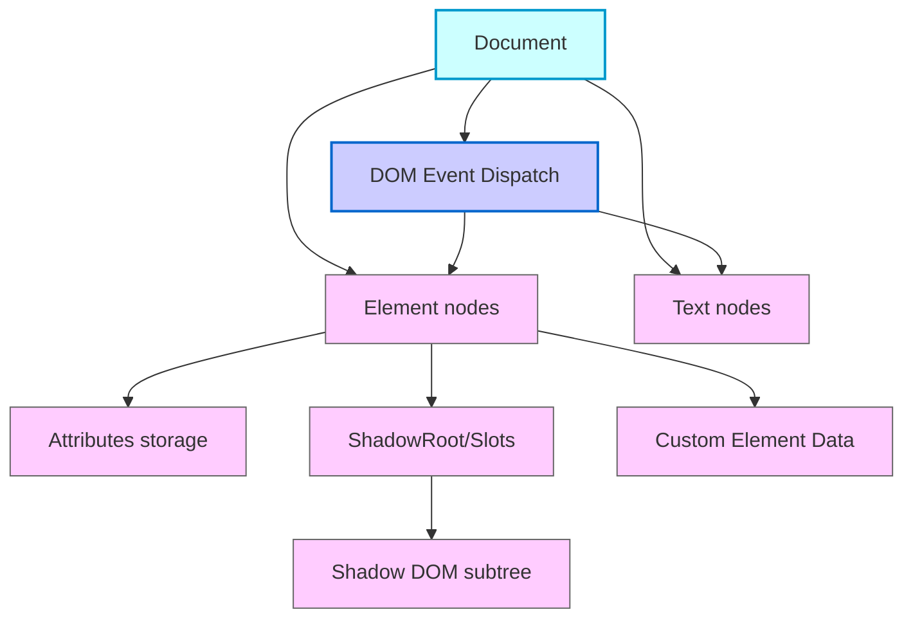
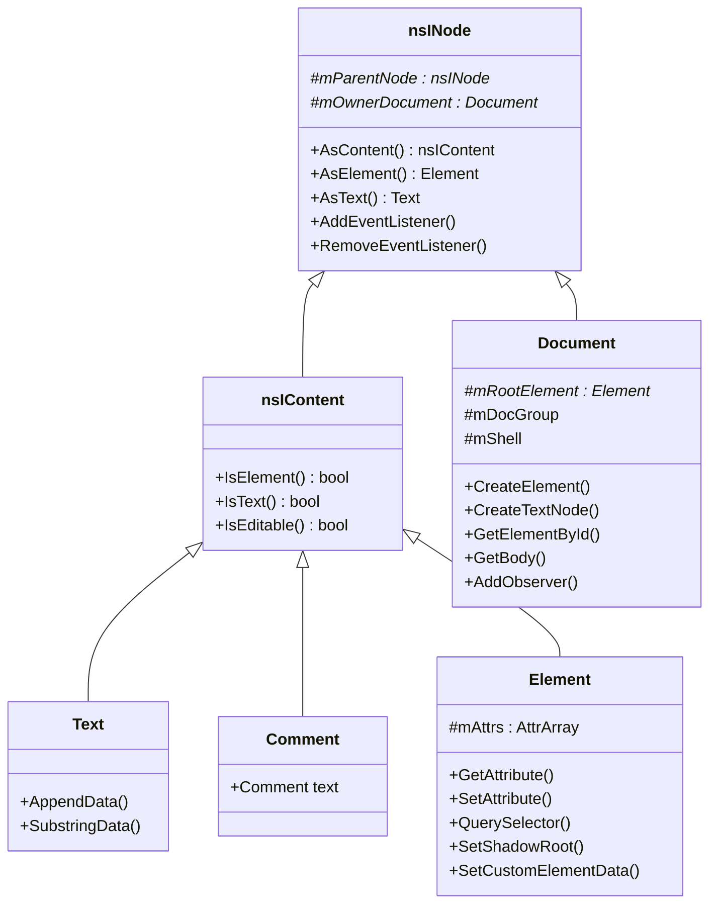

[<< Previous Chapter (Firefox Architecture)](./04_architecture.md)

# Chapter 5: DOM – Where Documents Come to Life

> **“Everything you see and interact with in a webpage—the text, images, form fields, scripts, events—lives in the DOM. Mastering the DOM is like discovering the hidden puppet strings behind the entire web.”**  
> – A staff engineer explaining why a single `
` can sometimes cause a thousand reflows

## 5.1 Overview

Welcome to **Chapter 5**, where we dive into the **Document Object Model (DOM)**—the beating heart of every web page. We’re going to cover every corner of the DOM architecture in Gecko, from **HTML parsing** and **node trees** to **selection/ranges**, **service workers** intercepts, **copy/paste** handling, **shadow DOM**, **event dispatch**, **editor integration**, and **Fission** implications. By the end, you’ll have:

- A deep understanding of **DOM data structures** (`nsINode`, `Element`, `Document`, etc.).  
- Insights into **memory management** (reference counting, **cycle collection**, integration with the JS **garbage collector**).  
- A breakdown of **navigation**, **selection**, **ranges**, and advanced features like **shadow DOM** and **custom elements**.  
- Detailed coverage of **HTML parsing**—how bytes turn into a living DOM tree.  
- The interplay with **editor** code, **service workers**, and **copy/paste** flows.  
- Performance pitfalls, debugging tips, and how **Fission** can split your DOM across processes.

This chapter is significantly larger than any prior iteration—prepare for a deep dive.

---

## 5.2 The DOM in Gecko: High-Level Foundations

### 5.2.1 DOM Concept Recap

The **Document Object Model** is a tree-like, language-agnostic interface describing HTML or XML documents. Every tag, attribute, text chunk, and comment is a **node** in this structure. The DOM is dynamic: scripts can create, remove, or modify nodes at runtime. In Firefox, the DOM underpins layout, styling, scripting, and user interaction.

### 5.2.2 DOM vs. Frame Tree vs. Style Data

To avoid confusion, keep in mind:

1. **DOM**: A data model representing document structure and content, living mostly in `dom/`.  
2. **Frame Tree**: Layout’s representation of boxes and flows (discussed in [Chapter 6](./06_layout.md)).  
3. **Stylo/Servo Style**: The parallel CSS matching system in `layout/style/`.  

These three, while interrelated, are separate. The DOM’s job is to maintain the logical structure of the page. Layout’s job is to figure out the geometry. Style’s job is to figure out the final CSS properties used by layout. JavaScript code interacts primarily with the DOM, though changes can cascade into style and layout phases.

---

## 5.3 HTML Parsing: Turning Bytes into DOM Trees

### 5.3.1 The Parser Pipeline

The **HTML parser** transforms raw text from the network into DOM nodes:

1. **Tokenizer**: Scans the byte stream, recognizes tokens (`
`, ``, `<!-- comment -->`, text nodes, etc.).  
2. **Tree Construction**: Follows the HTML5 parsing spec’s insertion modes (e.g., “in body,” “in table,” “in head” states), building a DOM element hierarchy.  

In Gecko, parsing logic lives in `parser/html/` (`nsHtml5*` files). A simplified flow might be:

1. Data arrives from the network in chunks.  
2. The parser’s **nsHtml5StreamParser** tokenizes incrementally.  
3. The **tree builder** uses rules from the HTML standard to decide how to nest tags.  
4. The parser then hands off nodes to the `Document`.  

### 5.3.2 Spec-Driven Behavior

HTML5 is rife with error-correction rules (like auto-inserting `<tbody>` in tables, or ignoring certain malformed tags). The parser code has to replicate these precisely. That’s why the `nsHtml5TreeBuilder` is large and somewhat opaque—it implements the entire HTML5 spec state machine.

### 5.3.3 Relationship to DOM

As the parser creates elements or text nodes, it calls into DOM creation methods (e.g., `Document::CreateElement()`). The newly created node is appended to the DOM tree. If scripts run during parsing (like an inline `<script>`), parsing can pause, letting script manipulate the partially constructed DOM. Once done, parsing resumes.

### 5.3.4 Incremental and Speculative Parsing

Firefox can parse ahead while the layout or script runs in parallel (to some extent). This is a big performance boost but also means concurrency complexities. A script might call `document.write`, forcing the parser to sync if it was in the middle of a partial parse. Handling these corner cases is extremely tricky.

---

## 5.4 Data Structures: `nsINode`, `nsIContent`, `Element`, `Document`

### 5.4.1 `nsINode`

The base class for all DOM nodes:

- **Fields**: `mParent`, `mFirstChild`, `mNextSibling`, `mOwnerDocument`.  
- **Methods**: `AsElement()`, `AsText()`, reference counting, cycle collection participation.  

`nsINode` is abstract; real node types like `Element` or `Text` derive from it.

### 5.4.2 `nsIContent`

An `nsINode` that can appear in a document’s content model. Subclasses include `Text`, `Comment`, `Element`. `nsIContent` adds methods for attributes, text operations, or specialized behaviors.

### 5.4.3 `Element`

Represents an HTML/XML element. Key responsibilities:

- **Attributes**: Storing them in arrays or hash maps for quick lookup.  
- **DOM Methods**: `setAttribute()`, `getAttribute()`, `querySelector()`.  
- **Integration with Layout**: Each `Element` may correspond to frames.  
- **Namespace Handling**: E.g., `<svg>` in `kNameSpaceID_SVG`.

### 5.4.4 `Document`

A specialized `nsINode`, top-level container:

- **Holds** references to the root element (`<html>` for HTML docs).  
- **Manages** sub-resources (scripts, style sheets) and security (CSP, same-origin checks).  
- **Implements** events like `DOMContentLoaded`, lifecycle hooks, and advanced features (fullscreen API, pointer lock).  

Because it can do so much, `Document.cpp` is enormous.

---

## 5.5 Memory Management: GC (SpiderMonkey) + CC (Cycle Collector)

### 5.5.1 The Problem: Cycles Everywhere

The DOM references JavaScript objects, which reference DOM objects, which reference each other. A simple example:

- JS object -> references a DOM Element (via a variable `let el = document.getElementById("x")`).  
- That Element -> references its `ownerDocument`, possibly JS event listeners, etc.

Naive reference counting or naive GC can’t handle cycles spanning the C++ and JS worlds. Hence, **cycle collection** and **GC** must cooperate.

### 5.5.2 Cycle Collection (CC)

**Cycle Collector** in Gecko:

1. Periodically scans all cycle-collected objects (DOM nodes, XPCOM objects that implement cycle-collection).  
2. Builds a graph of references.  
3. Finds subgraphs with no external roots.  
4. Frees them.  

DOM classes have macros like `NS_IMPL_CYCLE_COLLECTION_WRAPPERCACHE` that define how to traverse references. For instance, `Document` might list references to its root element, style sets, event listeners, etc.

### 5.5.3 JavaScript Garbage Collector

SpiderMonkey’s GC handles JS objects. A DOM node is exposed to JS via **XPConnect** wrappers. If a JS script drops the last reference to a DOM object but the DOM object references a different JS object, we can have a cycle. The solution is a **coordinated** approach:

- The JS GC marks live JS objects.  
- The cycle collector checks which DOM nodes are still strongly referenced.  
- If a DOM node is only referenced by dead JS objects (or vice versa), the cycle is collectible.

### 5.5.4 Debugging CC/GC

Use:

- **about:memory**: Real-time snapshots of memory usage, including cycle collector stats.  
- **XPCOM_CC_LOG**: Logs cycle graphs for diagnosing leaks.  
- **SPIDERMONKEY GC logs**: Environment variables like `JS_GC_LOG_FILE` or `MOZ_LOG=js:5` for deep debugging.

---

## 5.6 Selection, Ranges, and Navigation

### 5.6.1 Selections and Ranges

When a user highlights text, the DOM’s **Selection** object manages the anchor/focus points. Behind the scenes, **Range** objects identify start and end nodes/offsets in the tree.

- **`Selection`**: Typically found in `dom/base/nsFrameSelection.cpp` or `Selection.cpp`.  
- **`Range`**: Represents a continuous span in the DOM, from `(startContainer, startOffset)` to `(endContainer, endOffset)`.

Internally, editing or copy/paste heavily relies on these. The Editor module can manipulate selections (e.g., making them bold or deleting them).

### 5.6.2 Navigation and Session History

**Navigation** (like following a link, going back/forward) triggers new documents or reuses existing ones from BFCache. The DOM might be “frozen” for BFCache, then “resurrected” when the user goes back. Fission complicates this: cross-origin frames might each handle their own session history entries, requiring cross-process coordination.

### 5.6.3 Service Workers and Offline Navigation

**Service Workers** can intercept navigation requests. If a user clicks a link, the SW can serve a cached response or rewrite it. The DOM sees a new `Document` or subresource load, but the actual network request might be bypassed if the SW decides so. The architecture to route the request to the SW, then to the parser and DOM, is in `dom/serviceworkers/` and `netwerk/`.

---

## 5.7 Copy/Paste and Clipboard Integration

### 5.7.1 The ExecCommand Path

Historically, `document.execCommand("copy")`, `document.execCommand("paste")`, etc., allowed quick copy/paste. Under the hood:

1. The **Editor** code sees the command.  
2. If it’s “copy,” the **Selection** range content is serialized to text/HTML.  
3. The system clipboard is updated (platform-specific bridging in `widget/` or `editor/clipboard`).  

### 5.7.2 Modern Clipboard API

**`navigator.clipboard.writeText()`** or `readText()` uses a promise-based API, requiring user gestures or permissions. This is integrated with the DOM security model, so if a site tries to read from the clipboard without user action, it’s typically blocked.

### 5.7.3 Cross-Process

In Fission, the actual clipboard calls might happen in the parent process or OS-level code, while the content process requests them via IPC. The DOM sees a unified interface, but behind the scenes, it’s multiple process messages to ensure no malicious frame can read the clipboard without permission.

---

## 5.8 Event Dispatch in Depth

### 5.8.1 Capture, Target, Bubble

The W3C model:

1. **Capture Phase**: From document root down to the target.  
2. **Target**: The event fires on the actual node.  
3. **Bubble Phase**: The event travels back up.

Firefox’s `EventDispatcher` orchestrates this. Each `nsINode` might have an `EventListenerManager`. The manager holds listeners keyed by event type (e.g., “click”).

### 5.8.2 Cross-Process Under Fission

If a cross-origin iframe is in another process, and an event (like `mousedown`) occurs there:

1. The child process sees the raw OS event.  
2. The event is dispatched in that process, capturing, targeting, bubbling as normal within that DOM subtree.  
3. If it needs to bubble to the parent’s DOM (like a top-level capture event), an IPC message is sent to the parent.  
4. The parent process continues the bubble or capture phases as needed.

This is far more complex than single-process e10s, as multiple subtrees might bubble in separate processes. Edge cases (like stopPropagation) require careful bridging.

### 5.8.3 Synthetic Events and `dispatchEvent`

Developers can create events via `new Event('myCustom')` or `new MouseEvent(...)` and call `.dispatchEvent(element)`. The engine treats these like normal events, though they skip the OS-level input pipeline. If the event is on a remote iframe, bridging still might occur if the event is configured to bubble/capture outside that process.

---

## 5.9 Shadow DOM & Custom Elements

### 5.9.1 Shadow DOM Basics

- **ShadowRoot**: An attached subtree of DOM nodes that’s isolated from the main page’s CSS (unless specifically exposed).  
- **Open vs. Closed**: Open shadow roots are script-accessible via `element.shadowRoot`. Closed shadow roots hide their internal structure.  
- **Slotting**: A mechanism for distributing child content into placeholders `<slot>`.

In C++:

- `ShadowRoot` inherits from `DocumentFragment`, specialized for style scoping, slot management, etc.  
- The parser or script can create a shadow root via `element.attachShadow({ mode: 'open' })`.

### 5.9.2 Custom Elements

**Custom Elements** let devs define new HTML tags with custom behavior:

1. **Registration**: `customElements.define('my-widget', MyWidgetClass)`.  
2. **Upgrading**: When the parser encounters `<my-widget>`, it upgrades it to `MyWidgetClass`.  
3. **Lifecycle Callbacks**: `connectedCallback`, `disconnectedCallback`, `attributeChangedCallback`.

The logic is in `dom/webcomponents/`. The parser or `InnerHTML` calls may create placeholder elements that later get “upgraded” once the custom element definition is known.

### 5.9.3 Integration with Layout and Fission

Shadow DOM often has separate style scoping. For layout, shadow trees are part of the element’s normal flow, but the CSS is restricted. Under Fission, each custom element or shadow tree remains in the same process as the host element. Cross-process iframes are separate, so a shadow root in the child does not unify with a shadow root in the parent.

---

## 5.10 The Editor Module & DOM Ties

### 5.10.1 Why the Editor?

The **Editor** is responsible for text editing in `<textarea>`, `<input>`, or contenteditable areas. It deals heavily with:

- **Node Splits/Merges**: Breaking or joining text nodes during typing or formatting.  
- **Selection**: Maintaining caret or highlight range.  
- **Undo/Redo**: Transaction-based system that manipulates the DOM.  

### 5.10.2 IME and Script

When a user types non-Latin text using an Input Method Editor (IME), partial compositions appear in the DOM, then commit or revert. The Editor must handle partial text insertion or event bridging to scripts (like input or composition events).

### 5.10.3 Collaboration with Cycle Collection

Editor code references DOM nodes extensively. If you hold a pointer to a node in your editor object, you must properly implement cycle collection macros. Failing to do so can lead to memory bloat if you’re unlucky enough to create cyclical references with JS-based event listeners.

---

## 5.11 Service Workers and the DOM

### 5.11.1 Request Interception

**Service Workers** intercept network requests for the DOM (like `` or fetch calls). The resulting data (from the network or cache) is fed into the parser or script environment. The DOM sees a normal resource load, but behind the scenes, a SW might have handled the request.

### 5.11.2 Offline Support

Offline web apps rely on SW caching. The DOM tries to load a script or ``; if the user is offline, the SW can respond from cache. The DOM remains oblivious to whether it’s from network or local store. However, if the SW fails to respond, the DOM load might fail or fallback to normal network logic.

### 5.11.3 Fission Aspect

If a cross-origin iframe tries to fetch resources, that request might route to a different SW in a separate content process. The parent or socket process or the SW’s process then decides how to respond. In the DOM environment, it looks consistent, but concurrency and multi-process complexities are non-trivial.

---

## 5.12 Performance Pitfalls

### 5.12.1 Large DOM Trees

A page with tens or hundreds of thousands of elements is slower to manipulate. Each insertion or style recalc can cost more. Solutions:

- Use **document fragments** to batch insert.  
- Rely on virtualization (render only visible parts).  

### 5.12.2 Layout Thrashing

Constantly reading layout data (`offsetWidth`) after writing style can force synchronous reflows. The DOM must remain in sync with layout. Strategy:

- Batch your reads/writes.  
- Use `requestAnimationFrame` to coordinate DOM changes.

### 5.12.3 Memory Leaks / CC Issues

Add-ons or scripts might stash references to DOM nodes in global objects. If the cycle collector never sees them unreferenced, memory usage climbs. Tools like `about:memory` or `Cycle Collector Logs` are essential.

### 5.12.4 Cross-Process Overhead

With **Fission**, accessing remote iframes’ DOM or dispatching events might require multiple IPC messages. If your code does frequent cross-origin DOM manipulation, performance can degrade. Minimizing these interactions or using `postMessage` with coarse data can help.

---

## 5.13 Debugging the DOM

### 5.13.1 DevTools Inspector

- **Element Pane**: Shows the DOM tree, lets you manipulate attributes, see computed styles, etc.  
- **Event Listeners Pane**: Lists attached listeners, including which object or function handles them.  

### 5.13.2 about:memory & CC Logs

- **about:memory**: Summaries of how many DOM nodes, documents, etc., exist and their memory usage.  
- **CC Logs**: Detailed cycle graphs. If you suspect a leak or stuck references, parse these logs to find orphaned cycles.

### 5.13.3 DOMi (DOM Inspector) [Legacy Tool]

An older extension that displayed the XUL/HTML DOM tree in a separate window. Some devs still use it for advanced debugging or legacy code. Modern devs mostly rely on DevTools Inspector.

### 5.13.4 Logging / Instrumentation

You can add logging macros (like `MOZ_LOG=dom:5`) for verbose DOM logs. Or insert `printf`-style statements in local builds if you’re chasing a specific bug. The huge size of `Document.cpp` or `Element.cpp` can be daunting, so being systematic is key.

---

## 5.14 Advanced Mermaid Diagrams

### 5.14.1 Overall DOM Architecture (Enlarged)

### 5.14.2 Class Hierarchy Focus

---

## 5.15 Fission Revisited: Cross-Process DOM

### 5.15.1 Remote Frames

When a cross-origin iframe is placed in a different process under Fission, the top-level document’s node for `<iframe>` is just a **shell**. The actual child document lives remotely. Scripting inside that iframe references a distinct `Document`. The parent can’t just do `iframe.contentWindow.document.body` and access everything—if it’s cross-origin, it might be blocked or it must route through IPC bridging.

### 5.15.2 Remote Browsing Context & IPDL Actors

A `BrowsingContext` object tracks the relationship between top-level and child frames. If the child is cross-process, the DOM calls are turned into IPDL messages. For instance:

- The parent calls `iframeEl.contentWindow.postMessage(...)`.  
- This triggers an IPC message to the child process, delivering the event to the right document.  
- The child’s DOM receives it, possibly modifies or dispatches local events.

### 5.15.3 Security Gains

**Site isolation** ensures a compromised cross-origin doc can’t rummage through the parent doc’s memory. The boundary is an OS-level process separation, preventing direct pointer access. This is a huge step forward from single-process days, though it adds architectural complexity.

---

## 5.16 War Stories: DOM Edition (Extended)

1. **Mega InnerHTML**: A site replaced its entire `<body>` via `.innerHTML = hugeString` in a loop. Each update invalidated the entire subtree, triggering massive re-parses and reflows. The fix: build a `DocumentFragment`, manipulate it offline, then do one insertion.  
2. **Zombie Documents in BFCache**: A doc was supposed to be in BFCache, but a script in a privileged add-on kept references to it, preventing it from being fully frozen or discarded. Over days, memory soared. Ultimately the doc was stuck in an undead state. The fix was teaching the extension dev about removing references or forcibly evicting from BFCache.  
3. **Shadow DOM Collision**: Two frameworks tried attaching separate shadow roots to the same element (only one is allowed). The second attach silently failed, leading to unpredictable styling. The dev spent days debugging why “my shadow styles do nothing.”  
4. **Clipboard Race**: A user typed Ctrl+C rapidly while the page was re-rendering. Some rapid event dispatch merges caused the Editor code to fetch an empty selection or stale text. The root cause was an event timing mismatch between content processes. A patch introduced a small buffer so that ephemeral selection changes were recognized properly.  
5. **IMEs & Composition**: In multilingual sites, the user typed East Asian characters in a contenteditable. Each keystroke triggered partial text nodes, and the script had custom `input` event listeners. A subtle bug introduced double composition commits, duplicating text. Debugging the partial composition data flow took months.

---

## 5.17 Best Practices for DOM Performance & Memory Health

1. **Minimize Large DOM Manipulations**: If you’re adding thousands of elements, do it in a detached `DocumentFragment`, then append once.  
2. **Avoid Layout Thrash**: Don’t read layout data (`getBoundingClientRect()`) repeatedly after each minor DOM update. Batch your reads.  
3. **Clean Up References**: If your script no longer needs a DOM node, ensure any event listeners or global references are removed. Let the cycle collector do its job.  
4. **Shadow DOM for Encapsulation**: Great for modular components, but keep subtrees lean.  
5. **Use Observers** (MutationObserver, IntersectionObserver) wisely. Observing too many nodes or frequent changes can degrade performance.

---

## 5.18 Conclusion & Next Steps

In Chapter 5, we covered:

- **HTML Parsing**: How bytes become DOM nodes, incremental vs. blocking scripts, error recovery.  
- **Core Classes**: `nsINode`, `Element`, `Document`, text/comment nodes, attribute storage.  
- **Memory Management**: Cycle collector bridging with SpiderMonkey’s GC, and debugging references.  
- **Selection & Ranges**: Core to editing, caret management, copy/paste.  
- **Navigation & BFCache**: The DOM’s role in session history, offline modes, and service worker intercepts.  
- **Events**: Capture, bubble, cross-process dispatch under Fission.  
- **Shadow DOM & Custom Elements**: Encapsulated subtrees, custom HTML expansions.  
- **Editor** interactions: How text entry modifies nodes, IME handling, partial compositions.  
- **Fission**: Cross-process node boundaries, remote frames, site isolation benefits.  
- **Performance & Debugging**: Tools to find memory leaks, reduce layout thrash, handle large DOMs.

Up next, **[Chapter 6: Layout in Gecko](./06_layout.md)**, where we’ll see how these DOM nodes become visual frames on the screen, how reflows happen, and how advanced rendering pipelines (like WebRender) tie in. **Keep the DOM knowledge handy**—everything about frames depends on the underlying DOM structure. We’ll also continue exploring how multi-process architecture affects reflows and painting in a Fission world.

---

[Next Chapter >> (Layout in Gecko)](./06_layout.md)
