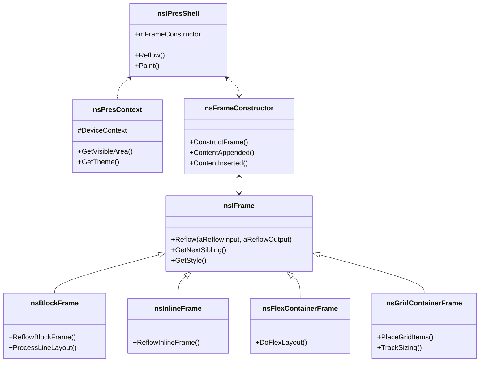

# Chapter 6: Layout in Gecko

[<< Previous Chapter (DOM)](./05_dom.md)

> **“You can’t just slap HTML elements on a page and hope they line up. Layout is a delicate dance of frames, flows, and reflows.”**  
> – A layout engineer explaining the difference between DOM and layout

## 6.1 Overview

Having explored the **DOM** in exhaustive detail, we now turn to **Layout**, where those DOM nodes become **visual boxes** on-screen. This is a **massive** subsystem in Firefox, often referred to as the **layout engine** or **rendering engine**. We’ll elaborate on:

- **Frame Construction**: How DOM nodes yield frames, blocks vs. inlines, flow context, etc.  
- **Reflow**: The recursive, iterative process that calculates each box’s size and position.  
- **Layout Algorithms**: Block, inline, flexbox, grid, table layout, plus quirks.  
- **Painting & Compositing**: Summaries of how frames turn into layers, ultimately rendered by **WebRender** (in modern Firefox).  
- **Fission Impact**: Multi-process splits and out-of-process iframes.  
- **Performance Pitfalls**: Layout thrashing, forced reflows, large content.  
- **Debugging Tools**: DevTools layout inspector, reflow logs, etc.

If the DOM is the skeleton, **layout** is the muscle that moves it into shape for the user.

---

## 6.2 Frame Trees vs. DOM Trees

### 6.2.1 Why Separate Data Structures?

- **DOM Tree**: A conceptual representation of elements, text, attributes (see [Chapter 5](./05_dom.md)).  
- **Frame Tree**: A layout data structure used to measure and position content. A single DOM node might produce multiple frames (e.g., split text) or none (`display: none`).

### 6.2.2 nsIFrame and Subclasses

In Gecko, `nsIFrame` is the base class for layout objects:

- **Block frames** (`nsBlockFrame`) for block-level elements like `
`.  
- **Inline frames** (`nsInlineFrame`) for inline content like ``.  
- **`nsLineBox`** in `block/` code to manage line layout.  
- **Special frames** for tables (`nsTableFrame`, `nsTableCellFrame`), flex (`nsFlexContainerFrame`), grid (`nsGridContainerFrame`), etc.

Once the DOM is parsed and styles are computed, the layout engine instantiates frames to represent each element’s visual box (or set of boxes). This is stored in a frame tree parallel to the DOM.

### 6.2.3 Frame Creation and Lifetimes

The style system determines `display` (block, inline, flex, grid). Layout sees these style hints and calls frame constructors to produce the right `nsIFrame` subtype. If the element’s style changes from `display: block` to `display: none`, the old frames might be destroyed, or the new ones created. This is managed by reflow code and style change handling.

---

## 6.3 Flow and Formatting Contexts

### 6.3.1 Block Formatting Context

Traditionally, layout organizes **block-level** elements in vertical stacks. Each block can contain inline content forming line boxes. Some aspects:

- Margins can collapse between consecutive blocks.  
- The engine uses `nsBlockFrame` to handle paragraphs, `
`s, etc.  
- Floats (`float: left/right`) are placed in a side “float area,” and the block content wraps around them.

### 6.3.2 Inline Formatting Context

Within a block, **inline** elements or text run horizontally until they run out of space, then wrap to the next line. The engine builds **line boxes**, each containing text runs or inline elements. Tools:

- **`nsLineLayout`** orchestrates placing inline frames and text.  
- **`nsTextFrame`** handles glyph measurement, line breaks, optional hyphenation.

### 6.3.3 Other Layout Modes

- **Table Layout**: `<table>`, `<tr>`, `<td>` frames in `nsTableFrame.cpp`. Complex spanned cells, row groups, table captions.  
- **Flex Layout** (`display: flex`): `nsFlexContainerFrame` calculates main/cross axes, item alignment, etc.  
- **Grid Layout** (`display: grid`): `nsGridContainerFrame` for placing items in row/column tracks, auto-flow logic.

Each mode has unique algorithms and data structures.

---

## 6.4 Reflow: The Heart of Layout

### 6.4.1 The Reflow Algorithm

Reflow is a top-down, recursive procedure:

1. **Root Frame**: Called with an available width/height.  
2. **Child Frames**: Each child is reflowed with constraints (e.g., block context might say “you have 600px width to fill”).  
3. **Child Returns Desired Size**: The child calculates its own size (width, height, maybe a maximum of 300px for images?).  
4. **Parent Adjusts**: The parent might place the child, check for overflow, continue with next child.  
5. **Iterate**: If a child’s final size differs from assumptions, the parent might reflow again.

Hence, a single user action can trigger multiple partial or full reflows if size assumptions change drastically (like toggling a large image’s display).

### 6.4.2 Intrinsic vs. Extrinsic Sizing

- **Intrinsic**: The content’s natural size (like an image’s pixel size, text’s computed size, etc.).  
- **Extrinsic**: The space constraints from the container.  
- Layout merges these factors. For example, if a flex item has `flex: 1`, the container might expand or shrink it to fill leftover space.

### 6.4.3 Invalidation and Incremental Reflow

To avoid reflowing the entire document on every small change, Gecko tries incremental reflows. A style or DOM change sets “dirty bits” on affected frames, reflowing only those subtrees. However, sometimes changes bubble up or cascade into larger reflows (like altering the root font-size).

---

## 6.5 Painting and Compositing

### 6.5.1 Display Lists

After layout decides positions, the engine builds a **display list**:

1. Each frame emits display items (e.g., background, border, text, box shadow).  
2. The display list is sorted by painting order (stacking contexts, z-index).  
3. These items are fed to **WebRender** or the old painting pipeline.

### 6.5.2 Layers and WebRender

Modern Firefox uses **WebRender** (in `gfx/wr`) to push geometry to the GPU. The old approach had separate “layer” objects (`ThebesLayer`, `ContainerLayer`). Now, display items become **primitives** (rects, images, text runs) in WebRender’s scene graph, composited on the GPU.

### 6.5.3 GPU Process

With multi-process (e10s, Fission), the **GPU process** can handle rendering. The content process just sends display commands. If a driver crash occurs, the GPU process can restart without killing the entire browser.

---

## 6.6 Special Topics: Tables, Flex, Grid

### 6.6.1 Tables

`<table>` elements form a specialized layout:

- **Table Frame** (`nsTableFrame`): The container for rows and columns.  
- **Row Group Frames**: `<tbody>`, `<thead>`, `<tfoot>`.  
- **Cell Frames**: `<td>`.  
- Spanning cells can complicate row/column sizing. The engine attempts “auto layout” or “fixed layout” depending on CSS/table rules.

### 6.6.2 Flexbox

`nsFlexContainerFrame` implements the main/cross axis logic:

- Each flex item is measured for min/max size.  
- The container distributes free space along the main axis based on `flex-grow`, `flex-shrink`, `flex-basis`.  
- Alignments like `justify-content`, `align-items` place items within the container.  
- The code is fairly large, as flex has many edge cases: wrap vs. nowrap, nested flex containers, etc.

### 6.6.3 CSS Grid

`nsGridContainerFrame` is even more elaborate, supporting row/column definitions:

- **Track sizing**: Each row or column can be `auto`, fixed, `min-content`, `max-content`, or fraction (`fr`).  
- **Cell placement**: Items can specify `grid-row: 2 / 5`, `grid-column: 1 / 3`.  
- Auto-placement logic for items that lack explicit row/col.  
- Subgrid features are partially implemented/behind flags, continuing to evolve with the spec.

---

## 6.7 Fission and Layout

### 6.7.1 Out-of-Process iframes

Under Fission, cross-origin iframes are in separate processes. For layout:

1. The **parent** has an `iframe` frame, which is effectively a placeholder.  
2. The content for that iframe is laid out in the child process.  
3. The **compositor** merges the results, compositing the child’s rendered content in the correct spot.

Communication is needed to coordinate sizes—if the iframe’s content grows. The child might send updates about its content size. The parent updates the iframe’s frame rect. This can lead to complexities if the parent tries to measure a cross-origin child. It must rely on the iframe’s declared size or spec-limited behaviors (like same-origin disclaimers).

### 6.7.2 Performance

Cross-process layout changes can be more expensive if triggered frequently. The engine tries to batch these. If the child doc reflows every 16ms, it must send updated layer surfaces or size data back to the parent for compositing, potentially adding overhead.

---

## 6.8 Performance Pitfalls: Layout Thrashing, Large Paints

### 6.8.1 Layout Thrashing

Occurs when scripts repeatedly:

- **Write**: Adjust style, e.g., `element.style.left = ...`.  
- **Read**: Then read `element.offsetWidth` or `getComputedStyle`, forcing layout to compute a new state.  
- Repeated in a tight loop, each read can cause a forced reflow, stalling performance.

**Solution**: Batch DOM reads first, then batch writes (or use `requestAnimationFrame`) to avoid repeated forced reflows.

### 6.8.2 Large or Deep Layouts

Huge pages with thousands of nodes or complex CSS might cause slow reflows. Minimizing the depth or using virtualization (render only visible parts) can help. Tools like the DevTools Performance panel can reveal if layout is a bottleneck.

### 6.8.3 Overlapping Layers / Compositing

If you use too many 3D transforms or forced “layerization” (like `will-change: transform` on many elements), you can bloat GPU memory. The layout & rendering pipeline might generate too many layers, slowing down compositing. Use layer hints sparingly.

---

## 6.9 Debugging Layout

### 6.9.1 DevTools Layout Panel

Shows:

- Box model for selected elements (margin, border, padding).  
- **Grid/flex** highlighters: Outline grid areas, flex lines.  
- **Computed** vs. “used” values.  

### 6.9.2 about:config Tweaks & Logging

- `layout.frame_type_log`: If set, can log frame creation to the console for debugging.  
- `nglayout.debug.paint_flashing`: Flash areas being repainted, useful for diagnosing unnecessary repaints.

### 6.9.3 The Gecko Profiler

- Profiles reflow times, painting calls.  
- If you see repeated reflows triggered by a script, you can locate the exact JS function.

### 6.9.4 Dumping Display Lists

Using environment variables or debug flags, you can dump the entire “display list” to see what items are being painted. This is extremely verbose but can show hidden stacking contexts or misplaced layers.

---

## 6.10 Class Diagram: Key Layout Components

---

## 6.11 War Stories: Layout Glitches

1. **The 3px Mystery**: A developer found a `
` always offset by 3px in certain Windows fonts. Turned out line-height rounding plus an inline-block baseline alignment caused partial descender space. The fix was adjusting default line-height or forcing `vertical-align: top`.  
2. **Flexible Overflows**: A site using `display: flex` had an item that grew beyond container bounds. A single typo in the min-width logic caused an infinite loop in the reflow code, locking up the tab. The patch added a safety clamp for negative or huge values.  
3. **Nested Grids**: Deeply nested grids with fractional tracks ballooned the reflow time. The site had 20 nested grids. Reflow soared to 200ms on every resize. Devs refactored to reduce nesting or avoid some auto layout constraints.  
4. **Table Layout Hell**: An old intranet page used `<table>` for everything—10 nested tables deep, each using “auto” layout. Reflow took seconds. The dev replaced some tables with flex or CSS grid, cutting reflow time drastically.

---

## 6.12 Conclusion & Transition

In this look at **layout**, we covered:

- **Frame Construction**: The separate structure from DOM, specialized for geometry.  
- **Flow & Formatting**: Block vs. inline, floats, line layout, plus specialized table/flex/grid engines.  
- **Reflow**: The iterative sizing process that places child frames, returns final sizes, and can trigger reflows if geometry changes.  
- **Painting/Compositing**: Display lists, WebRender, GPU process integration.  
- **Fission**: Cross-process iframes, remote rendering.  
- **Performance**: Layout thrashing, large documents, over-layerization.  
- **Debugging**: DevTools, logging, the Gecko Profiler.

Next up: **[Chapter 7: Style and CSS Handling](./07_css.md)**, where we’ll see how **CSS** is parsed, matched, and computed in parallel (via Stylo) before finalizing the layout. This is the final piece of the puzzle bridging DOM, layout, and user presentation.

---

[Next Chapter >> (Style and CSS Handling)](./07_css.md)
