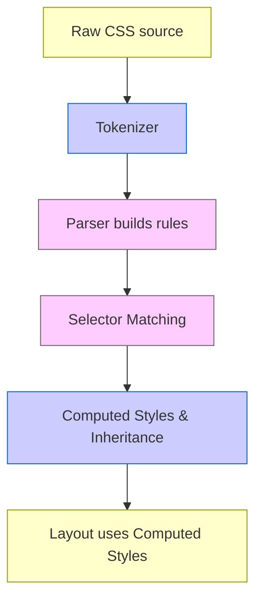
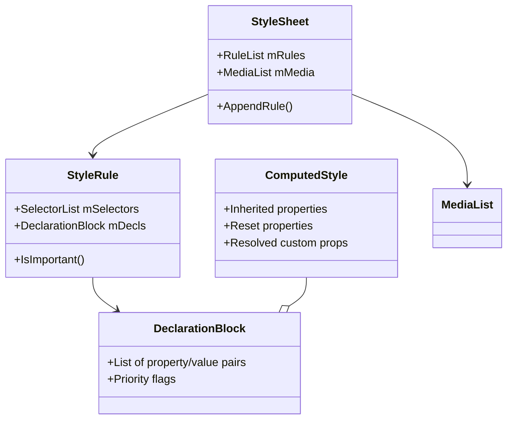

[<< Previous Chapter (Layout in Gecko)](./06_layout.md)

# Chapter 7: Style and CSS Handling

> **"A web page without CSS is like a blueprint without any paint or furnishings. The style system breathes life and aesthetics into the raw structure of the DOM."**  
> – A developer after debugging a 3-hour specificity conflict

## 7.1 Overview

Welcome to **Chapter 7**, where we dive deep into **CSS** and **style handling** in Gecko. If the **DOM** is the **structure**, and **Layout** is the **geometry**, then **CSS** is the **visual language** dictating color, fonts, spacing, animations, and more. In Firefox, this subsystem underwent a **major transformation** with **Stylo** (a.k.a. **Servo Style**), leveraging **Rust** for parallel rule matching.

This chapter covers:

1. **CSS Parsing**: How styles are tokenized and turned into rule data structures.  
2. **Selector Matching**: The heart of the cascade, specificity, and how elements get their styles.  
3. **Stylo**: Parallel style computation from the **Servo** project, integrated into Gecko.  
4. **Cascade, Inheritance, Computed Values**: The step-by-step pipeline turning author/user/UA rules into final property values.  
5. **Animations & Transitions**: The layers of CSS animations, transitions, and how the compositor can offload them (like transform/opacity) to the GPU.  
6. **Modern Layout Features**: Flexbox, Grid, container queries (experimental), and where they live in the style system.  
7. **Performance Pitfalls**: Minimizing re-style thrash, heavy selector usage, large style sheets.  
8. **Debugging & Tools**: DevTools, logging, about:styles? references, advanced instrumentation.  
9. **Fission Impact**: How multi-process site isolation influences style calculations, if at all, in cross-origin frames.

By the end, you’ll see how **Firefox** applies your CSS, merges it in the cascade, and hands it off to **layout** (covered in [Chapter 6](./06_layout.md)) to produce a final rendered page.

---

## 7.2 CSS Parsing & Rule Construction

### 7.2.1 The Parser Pipeline

When Firefox encounters a stylesheet (via a `<link rel="stylesheet">` or a `<style>` block), it:

1. **Fetches** the CSS text (could be inline or network-based).  
2. **Tokenizes**: The code in `servo/components/style/` (or older code in `layout/style/`) breaks the text into tokens (identifiers, strings, operators, at-keywords).  
3. **Builds** a rule list: For each CSS rule (like `"h1 { color: red; }"`), the parser constructs an internal data structure representing selectors and declarations.

Unlike legacy single-threaded approaches, **Stylo** can parse and handle some tasks in parallel. Once parsed, rules are stored in in-memory structures for **selector matching**.

### 7.2.2 Handling At-Rules, Media Queries

Mozilla’s engine supports **@media**, **@supports**, **@import**, **@keyframes**, etc. For instance, a `@media (max-width: 600px) { ... }` block is conditionally applied based on viewport size. The style system defers the actual evaluation of the condition to a later pass, storing each rule with metadata about the media query expression.

### 7.2.3 Error Recovery & Quirks

CSS specs require robust error recovery. If the parser sees something invalid (like `"color: ;"`), it drops that declaration but continues. This partial tolerance means real-world style sheets with minor typos still mostly work.

---

## 7.3 Selector Matching: The Heart of CSS

### 7.3.1 Basic Flow

To figure out which rules apply to an element, the style system:

1. **Gathers** all rules from relevant style sheets (author, user, UA).  
2. **Filters** them by media query, pseudo-classes, scope.  
3. **Matches** each rule’s selectors against the element’s tag name, classes, IDs, parent relationships, etc.  
4. **Collects** all matching declarations, sorts them by specificity and origin, then merges them into a final style.

### 7.3.2 Specificity & the Cascade

In short: ID selectors beat class/attribute selectors, which beat type selectors. Then there’s `!important`, which can jump priority further. Also, user-agent styles can be overridden by user styles, which can be overridden by author styles—unless a user style is `!important`. This hierarchical logic is the **cascade**.

A typical order:

1. UA normal rules  
2. User normal rules  
3. Author normal rules  
4. Author `!important` rules  
5. User `!important` rules  
6. UA `!important` rules  

(Implementation details sometimes vary, but that’s the usual stack.)

### 7.3.3 Parallelization with Stylo

Stylo attempts to do **parallel** selector matching across elements in the DOM. It slices the DOM tree into subtrees and matches in multiple threads. If your page is large, this can speed up style recalc. Each thread consults a shared set of rules (read-only data) while individually computing styles for assigned elements.

---

## 7.4 The Style Computation Pipeline

### 7.4.1 Flow from Specified to Computed Values

After matching selectors, each property has a **specified** value (like `"2em"` or `"calc(100% - 20px)"`). Then the style system must:

1. **Resolve** inheritance: If a property is inherited (e.g., `color`), the child’s computed value might be its parent’s final color.  
2. **Compute** relative lengths: Convert `2em` into absolute px if needed, based on parent’s font size.  
3. **Resolve** complex expressions: `calc(...)`, environment variables, and custom properties (CSS variables).  

The output is a **computed style**: a final map of property -> resolved value, stored in internal structures that layout reads.

### 7.4.2 Inheritance, Initial, and Unset

CSS properties can be:

- **Inherited** by default (like `color`, `font-family`).  
- **Not inherited** (like `margin`, `border`).  
- Could have `inherit`, `initial`, or `unset` keywords, each with specific fallback logic.  

The style system merges these rules carefully, referencing the parent’s computed style when needed.

### 7.4.3 Custom Properties (CSS Variables)

Properties like `--main-color: red;` are stored in a specialized structure. The engine treats them mostly as **strings** until they’re substituted. Inheritance is automatic. When you do `color: var(--main-color)`, the system resolves it by climbing up the tree to find the nearest defined custom property.

---

## 7.5 CSSOM & Programmatic Manipulation

### 7.5.1 CSSOM Basics

The **CSS Object Model** (CSSOM) exposes stylesheets and rules in script:

- `document.styleSheets[0]` might be a `CSSStyleSheet` object.  
- `CSSStyleSheet.cssRules` is a list of `CSSStyleRule`, `CSSImportRule`, etc.  
- You can manipulate them at runtime, e.g. `sheet.insertRule("body { background: blue; }", 0)`.

Under the hood, the style system is updated, and a re-style is triggered if needed. This can be powerful but also hamper performance if used excessively.

### 7.5.2 getComputedStyle

Calling `window.getComputedStyle(element)` returns a read-only object of the final computed values. Internally, it can force a style flush if the style data is out of date. This might trigger layout reflows if geometry is needed. So it’s good practice to minimize repeated calls in tight loops.

---

## 7.6 Animations & Transitions

### 7.6.1 CSS Animations

Defined via `@keyframes`, each animation has a name, keyframes (like `0% { opacity: 0; } 100% { opacity: 1; }`), and is applied with `animation-name`, `animation-duration`, etc. The style system sets up an **Animation** object:

1. Checks which properties are animatable.  
2. Interpolates them over time.  
3. The main thread or the compositor might handle the updates.  

Properties like `opacity` or `transform` can be offloaded to the GPU thread, ensuring smooth 60fps updates. Others, like `width` or `background`, might require layout or paint, thus staying on the main thread.

### 7.6.2 Transitions

When a property changes (like `color: red` to `color: blue`), a CSS transition can animate it over a set duration. The style system tracks the old and new values, generating an interpolated style each frame. If it’s a **compositor-friendly** property, the main thread hands it off to the compositor. Otherwise, we risk jank if layout or painting is involved each step.

### 7.6.3 Web Animations API

Developers can also script animations using the **Web Animations API**. That leads to `element.animate(...)` calls. Internally, it uses the same engine as CSS animations, but with direct script access to timing, keyframes, and playback controls (pause, reverse, etc.).

---

## 7.7 Modern CSS: Flexbox, Grid, Container Queries

### 7.7.1 Flexbox & Grid

Though these are layout features, the style system must:

1. Recognize `display: flex` or `display: grid`.  
2. Store relevant style data (like `flex-direction`, `justify-content`, `grid-template-columns`).  
3. Hand them off to layout, which does the actual box arrangement.  

**Stylo** or the old style system sets `ComputedStyle->mDisplay` to a special internal enum for flex or grid. The layout code then uses specialized classes (`nsFlexContainerFrame`, `nsGridContainerFrame`) to place child frames.

### 7.7.2 Container Queries (Experimental)

**Container queries** let an element style its children based on the container’s size, not just the viewport. The style system must re-check these whenever the container size changes. This is still evolving, with partial support or behind flags in some browsers. It can lead to more frequent re-style if container sizes vary.

### 7.7.3 Subgrid (CSS Grid 2)

**Subgrid** allows a nested grid item to share track definitions from the parent grid. The style system must store a reference to the parent track definitions, so layout can unify them. Implementation is ongoing, requiring both style data representation and new layout logic.

---

## 7.8 Performance & Pitfalls

### 7.8.1 Large Stylesheets

Thousands of rules or extremely complex selectors (like `div > ul li[class^="item"]:hover::after`) can slow down style matching. The engine tries to optimize typical patterns, but worst-case scenarios (deeply nested `:nth-child` or complicated combinators) can degrade performance on large pages.

### 7.8.2 Repeated Style Flushes

If a script changes classes or inline styles many times per second, the style system might re-match selectors repeatedly. Minimizing toggles or using transitions effectively can help. Grouping DOM changes or using `requestAnimationFrame` can reduce overhead.

### 7.8.3 Overuse of `!important`

Excessive `!important` can hamper maintainability and cause unexpected overrides. The style system obeys it, but debugging conflicts gets harder. Also, user styles with `!important` can override developer intentions.

### 7.8.4 Cascade Depth

Loading multiple large CSS frameworks or layering user styles, plus extensions injecting additional styles, can create a heavy cascade. The browser must keep track of all of them in the correct order. This can complicate debugging if you’re not careful about origin vs. author vs. user vs. UA layers.

---

## 7.9 Fission & Multi-Process

### 7.9.1 Does Fission Affect Style Directly?

Under **Fission**, the main difference is that cross-origin iframes live in separate processes. However, each content process still runs its own style system pass for the DOM it hosts. The parent process doesn’t style child frames—each content process does its own style calculations.

### 7.9.2 Cross-Document CSS?

A parent document’s style rules usually can’t affect a cross-origin child (due to the same-origin policy). So from a style standpoint, each process is mostly independent. However, the GPU/compositor might unify final rendering layers. If a child doc has 3D transforms, the parent doc sees them as separate stacked layers in compositing. No big changes to the style system are needed, beyond ensuring each content process has a consistent environment.

### 7.9.3 DevTools

When using **DevTools** to inspect a cross-origin iframe in Fission, the tool must talk to that separate process to retrieve computed styles. This can add complexity under the hood, but from a user perspective, it’s still a unified inspector. Each content process returns style data for its own DOM.

---

## 7.10 Debugging & Tools

### 7.10.1 DevTools: Rules & Computed Tabs

- **Rules**: Shows which CSS rules match the selected element, in cascade order.  
- **Computed**: Final property values after the cascade and specificity are resolved.  
- **Layout**: Renders outlines for flex or grid containers, helping visualize advanced layouts.

### 7.10.2 about:config, Logging

You can enable logs for the style system with environment variables or about:config flags (like setting `layout.css.servo.log.enabled`). This might produce a large volume of debug info about selector matching, cascade steps, or media query evaluations.

### 7.10.3 Performance Tools

- **Performance panel**: Measures time spent in style recalc vs. layout vs. scripting.  
- **Stylo profiler**: Some internal instrumentation can show how many threads or how much CPU time is used for parallel style matching.

---

## 7.11 Advanced Diagrams

### 7.11.1 The Style Engine Pipeline

### 7.11.2 Class Diagram for Style Structures (Simplified)

---

## 7.12 Future of CSS in Firefox

### 7.12.1 Container Queries, Subgrid, CSS Houdini

- **Container Queries**: Likely to see more robust, stable implementation in future releases.  
- **Subgrid**: Ongoing improvements to the Grid layout engine.  
- **Houdini**: Exposing parts of the CSS pipeline (Paint API, Layout API, typed custom properties). Partial support in Firefox, but more advanced features remain in progress.

### 7.12.2 Performance Optimizations

Stylo can continue to optimize parallel matching and caching. The browser might store partial results for repeated style patterns, or refine how partial style invalidations occur under dynamic changes.

### 7.12.3 Cross-Engine Collaboration

CSS evolves quickly via the CSSWG (CSS Working Group). Firefox devs collaborate with devs from other engines (Chromium, WebKit) to unify specs and reduce differences. That means ongoing spec changes keep the style system in flux.

---

## 7.13 Summary & Next Steps

We’ve expanded **Chapter 7** to cover the **entire** style system pipeline:

1. **Parsing**: How CSS text is turned into internal rule structures.  
2. **Selector Matching**: The cascade, specificity, parallel matching in Stylo.  
3. **Computed Styles**: Merging inherited properties, resolving `calc()`, custom properties.  
4. **Animations & Transitions**: Engine-level logic, GPU offloading for certain properties.  
5. **Modern Layout Features**: Flexbox, Grid, plus container queries under development.  
6. **Performance**: Minimizing heavy selectors, re-style thrashes, and large style sheets.  
7. **Debugging Tools**: DevTools, logs, performance measurement.  
8. **Fission**: Cross-process frames, style recalc in each content process separately.  
9. **Future**: Container queries, Houdini, ongoing performance refinements.

With **DOM** and **Style** thoroughly examined, next up is **[Chapter 8: JavaScript and SpiderMonkey](./08_js_spidermonkey.md)**, covering the JavaScript engine powering dynamic behavior on the web. You’ll see how the DOM integrates with JS, from event handlers to memory references. Then we’ll move on to **networking** (Chapter 9) and the **editor** module (Chapter 10). Stay tuned!

---

[Next Chapter >> (JavaScript and SpiderMonkey)](./08_js_spidermonkey.md)
