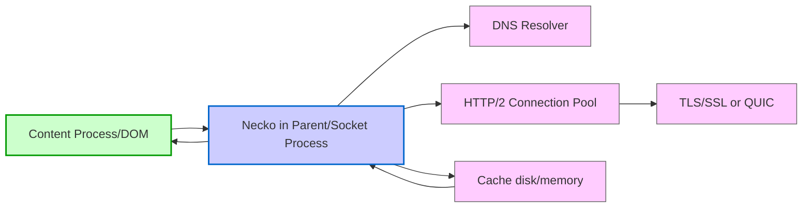
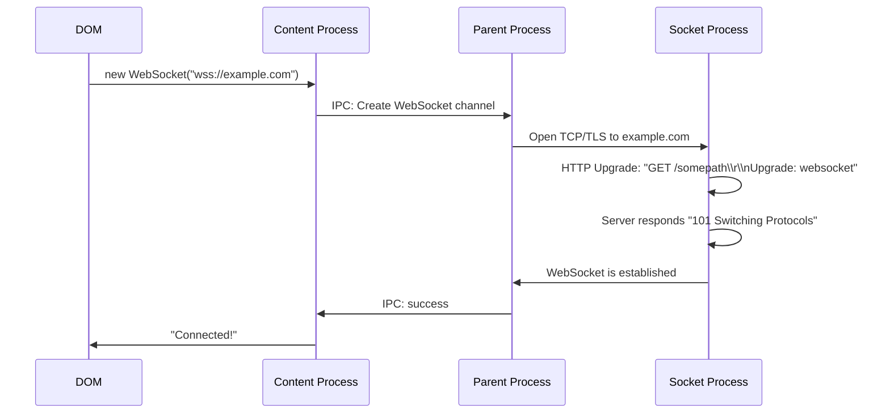

[<< Previous Chapter (JavaScript and SpiderMonkey)](./08_js_spidermonkey.md)

# Chapter 9: The Networking Stack

> **"A browser without a network is just a fancy document viewer. Networking is what connects us to the web’s boundless resources—HTTP, caching, security, all come together here."**  
> – A senior engineer explaining why half their day is spent reading network logs

## 9.1 Overview

Welcome to **Chapter 9**, where we embark on a deep dive into **Firefox’s Networking Stack**, often referred to as **Necko**. This subsystem is **massive**, enabling everything from a simple `` request to advanced features like **HTTP/2**, **HTTP/3 (QUIC)**, caching, WebSocket, **Service Worker intercepts**, **TLS/SSL** security, and more. By the end, you’ll understand:

1. **Necko Architecture**: Protocol handlers, `nsIChannel`, and how data flows from socket to the DOM or Service Worker.  
2. **HTTP Versions**: 1.1, 2 (multiplexing), and 3 (QUIC) with advanced features like server push or 0-RTT.  
3. **Caching Layers**: Memory cache, disk cache, revalidation, conditional requests.  
4. **Security**: TLS handshakes, certificate checks, HSTS, mixed content blocking, and more.  
5. **Advanced Protocols**: WebSockets, WebRTC basics, plus how Necko handles them.  
6. **Fission Impact**: Multi-process with separate content processes for cross-origin frames, socket process, concurrency.  
7. **Performance & Debugging**: Tools like DevTools Network panel, about:networking, logs, Wireshark, plus best practices to reduce overhead.

Let’s peel back the layers and see how **Firefox** seamlessly fetches your content under the hood.

---

## 9.2 Necko Architecture

### 9.2.1 Overall Flow

When the browser requests a resource—be it `<script src="app.js">`, a `fetch()` call from JS, or an `` element—**Necko** coordinates:

1. **URL Classification**: Decides which protocol (HTTP, HTTPS, file, blob, data, etc.).  
2. **Protocol Handler**: Creates an `nsIChannel` object for that protocol.  
3. **DNS Resolution**: Finds the server IP if it’s an HTTP(S) request.  
4. **Connection/Socket**: Reuses or opens a TCP/TLS (or QUIC) connection.  
5. **HTTP Transaction**: Sends request headers, receives response.  
6. **Caching**: Possibly short-circuits if the resource is fresh or does conditional GET if stale.  
7. **Data Delivery**: Streams response to the content process, or the Service Worker if intercepting.

Necko is **highly modular**, with code in `netwerk/`. Many subdirectories handle specific protocols (HTTP, WebSockets, etc.). Let’s illustrate with a diagram:



Under **Fission**, the actual networking might be in a **socket process** or parent process, ensuring cross-origin frames in separate content processes can still share connection pools if security allows.

### 9.2.2 nsIChannel and Protocol Handlers

At the top level, web requests use an **`nsIChannel`** interface:

- **HTTP Handler**: `nsHttpHandler` for `http://`, `https://`  
- **WebSocket Handler**: for `ws://`, `wss://`  
- **File Handler**, **FTP Handler** (historically), and more.

A single code path:

1. The content or parent process calls `NS_NewChannel(...)` with a URI.  
2. The appropriate handler is found via its **scheme**.  
3. A channel is returned, able to `Open()` or `AsyncOpen()` data streams.

---

## 9.3 HTTP Versions: 1.1, 2, and 3 (QUIC)

### 9.3.1 HTTP/1.1: The Foundation

- **Persistent Connections**: Multiple requests over one TCP connection.  
- **Pipelining**: Allowed request queuing, but turned out problematic with head-of-line blocking and proxy issues.  
- **Chunked Encoding**: Streaming data in chunks.

Necko uses a **connection pool** that reuses TCP connections for the same host:port, respecting concurrency limits (6 or so connections per domain, historically). Still, many small requests can saturate or block.

### 9.3.2 HTTP/2: Multiplexing

HTTP/2 introduced multiplexing multiple streams over one TCP connection:

- **Binary Framing**: Instead of textual headers, it uses frames.  
- **Header Compression** (HPACK) to reduce overhead.  
- **Server Push** (rarely used in the wild, but supported).  

Necko implements a separate `nsHttp2Session` object. Once a TCP+TLS is established, multiple streams are created for each request/response pair. This eliminates head-of-line blocking at the HTTP layer but can still suffer from TCP’s packet-level HOL if packet loss occurs.

### 9.3.3 HTTP/3 (QUIC)

**HTTP/3** runs over **QUIC** (UDP-based), reducing handshake latency (0-RTT) and better handling packet loss:

- **Separate Streams** at the transport level, no HOL blocking.  
- **Faster Handshakes**: Typically 1-RTT or 0-RTT if resuming.  
- **Complex Middlebox Issues**: Some firewalls or proxies block UDP, causing fallbacks to HTTP/2.

Necko’s QUIC code is in development (recently stabilized). If UDP fails, we typically fall back to HTTP/2. QUIC also has unique debugging challenges—packet captures in Wireshark require SSL keys to decrypt.

---

## 9.4 Caching and Revalidation

### 9.4.1 HTTP Cache (Cache2)

Firefox has a **two-tier** cache:

1. **Memory Cache**: Stores recent/active small resources in RAM for quick access.  
2. **Disk Cache**: On-disk storage for larger or older items.

**Cache2** replaced older code, offering better concurrency and robust indexing. When a new request arrives:

1. If the resource is fresh in cache (per `Cache-Control`, `Expires`, `ETag`, etc.), it’s returned instantly.  
2. If stale, Necko does a conditional GET (`If-None-Match`, `If-Modified-Since`). A `304 Not Modified` extends it.  
3. If no match, it fetches the full resource.

### 9.4.2 Interaction with Service Workers

**Service Workers** have their own **Cache Storage** (via the Cache API). This is separate from the main HTTP cache. A SW can intercept requests, serve them from `caches.open(...)`, or bypass to network. From the DOM’s perspective, it looks like a normal fetch—Necko or the SW just returns data. But you can have **double caching** (SW cache + HTTP disk cache) if not carefully managed.

### 9.4.3 Prefetch, Preconnect, Preresolve

To speed up future requests, the browser can **prefetch** resources, **preconnect** to servers, or **preresolve** DNS. For example, if a page includes `<link rel="dns-prefetch" href="//example.com">`, Necko might do DNS resolution early. Or `<link rel="preconnect" ...>` can open a TCP/TLS connection ahead of time. This must be used judiciously or you risk wasted connections.

---

## 9.5 Security: TLS/SSL, Certificates, Mixed Content

### 9.5.1 TLS Handshake

For **HTTPS**:

1. **TCP** (or QUIC) connect to server.  
2. **TLS ClientHello**: The client sends supported ciphers, extensions (ALPN for HTTP/2 or HTTP/3).  
3. **ServerHello**: The server picks a cipher, sends a certificate.  
4. **Certificate Verification**: Firefox checks the certificate chain against trusted roots, CRLite/OCSP for revocation.  
5. **Key Exchange**: Pre-master secret or ephemeral keys if using ECDHE.  
6. **Secure Connection**: All subsequent HTTP frames are encrypted.

Firefox’s cryptographic library is **NSS** (Network Security Services). The handshake logic is in `security/` and `nsNSSIOLayer.cpp`, hooking into the socket transport code.

### 9.5.2 Certificate Pinning & HSTS

- **HSTS**: Once a host sets `Strict-Transport-Security`, Firefox enforces HTTPS for that domain, ignoring user attempts to go HTTP.  
- **Pinning**: For crucial sites (like Mozilla, some banks), Firefox can pin certain public keys. If the cert chain doesn’t have the pinned key, it’s rejected.

### 9.5.3 Mixed Content Blocking

If an HTTPS page references an HTTP script or iframe, that’s **mixed active content**, typically blocked by default. Mixed images (passive content) might be allowed or optionally blocked for security. Necko enforces these policies, returning a blocked request or upgrading it if the site uses `upgrade-insecure-requests`.

---

## 9.6 WebSockets and WebRTC

### 9.6.1 WebSockets

**WebSockets** provide bidirectional messaging:

1. Starts as an HTTP/1.1 handshake with `Upgrade: websocket`.  
2. Once the server agrees, the connection flips to the WebSocket protocol.  
3. Data frames flow both ways until closed.

Necko’s WebSocket code is in `netwerk/protocol/websocket/`. The content or JS calls `new WebSocket(...)`, the code triggers the upgrade handshake, then the channel is replaced by a WebSocket connection. Under Fission, the child process might still route the handshake through the parent or socket process, but once established, frames flow asynchronously.

### 9.6.2 WebRTC Overview

WebRTC is more than just a Necko piece—it involves media capture, NAT traversal (ICE, STUN, TURN). Still, once a peer connection is established, the data or media flows over specialized protocols (SRTP, SCTP, etc.). Some interactions with Necko occur for STUN/TURN requests. Typically, WebRTC code is in `media/webrtc/`.

---

## 9.7 Service Workers and the Network Flow

### 9.7.1 Request Interception

When a page controlled by a **Service Worker** requests a resource, Firefox checks if the SW scope covers that URL. If so, it dispatches a `fetch` event to the SW script:

1. The SW can call `event.respondWith(...)` to provide a `Response` from its own cache or a custom response.  
2. If the SW doesn’t handle it, the request proceeds normally via Necko to the network.

### 9.7.2 Offline or Partial Intercepts

This mechanism powers offline apps. The SW might serve everything from local caches if offline. Meanwhile, Necko sees no direct network calls. For partial intercepts, the SW can fetch from the network and store the response in its own cache, returning it next time. This is different from the HTTP disk cache because it’s **script-managed** with the Service Worker’s logic.

### 9.7.3 Fission Aspects

If a cross-origin iframe has its own SW, that SW intercepts requests in that content process or whichever process runs the SW. Typically each origin’s SW runs in a separate process, ensuring no cross-origin data leaks. The top-level page’s fetch calls can’t be handled by a child SW unless same-origin rules permit.

---

## 9.8 Fission Impact: Multi-Process Networking

### 9.8.1 Socket Process

Some builds of Firefox enable a **socket process** separate from the parent. This process owns actual OS-level sockets, letting the parent or content processes request network operations. The data flows:

1. Content Process -> IPDL message -> Parent -> IPDL -> Socket Process  
2. Socket Process does DNS, TCP/TLS, HTTP.  
3. Streams data back via IPC to the content or parent.

### 9.8.2 Cross-Origin Frames

Under **Fission**, each cross-origin frame might be in a different content process. All share the same networking stack in the parent or socket process. They each have separate cookie jars or security constraints if `SiteIsolation` dictates. But if they request the same domain, they can reuse the same connection pool, respecting concurrency rules and security tokens.

### 9.8.3 Security Gains

Site isolation helps ensure that a malicious site can’t tamper with another site’s requests in the same process. Cookie and credentials remain in the parent or socket process, never directly accessible to content processes. This reduces the risk of cross-origin data leakage.

---

## 9.9 Performance and Debugging

### 9.9.1 DevTools Network Panel

- **Request Timings**: DNS, connect, SSL, wait, download phases.  
- **Headers**: Inspect request/response headers, cookies, CORS details.  
- **Throttling**: Simulate slow connections or offline.  

### 9.9.2 about:networking

- **Active Connections**: Current HTTP/2 sessions, QUIC connections, DNS cache entries.  
- **Logging** toggles: `MOZ_LOG=nsHttp:5,timestamp` can produce verbose logs of HTTP transactions.

### 9.9.3 Packet Capture (Wireshark)

For deep debugging, especially TLS or QUIC issues. You can set `SSLKEYLOGFILE` environment variable so Wireshark can decrypt your TLS traffic. QUIC decryption also possible if you log secrets. Just be careful with production secrets!

### 9.9.4 Fission Logging

If multi-process confusion arises (like a request from cross-origin iframe?), you can enable IPDL logs for channels. Something like `MOZ_LOG=ipc:5,nsHttp:5` might show message flows, though it can be extremely verbose.

---

## 9.10 War Stories: Real Networking Bugs

1. **The QUIC Fallback**: A user behind a corporate firewall blocked UDP. Every QUIC handshake timed out, falling back to HTTP/2. But the fallback logic had a bug leading to repeated handshake attempts, stalling page loads. The fix was a robust fallback after one or two tries, not indefinite.  
2. **Service Worker Cache Overload**: A site stored giant images in the SW cache, ignoring HTTP caching best practices. Disk usage ballooned, and normal eviction logic was bypassed. The user’s system slowed to a crawl. A patch forced the SW to respect global storage limits.  
3. **HTTP/2 Proxy**: Some older proxies incorrectly handle HTTP/2 frames. The browser would freeze waiting for valid frames that never arrived. The solution was a fallback to HTTP/1.1 or a “strict fallback” for known-bad proxies.  
4. **Security Cert Mix-Up**: A pinned domain changed its intermediate CA. The new chain wasn’t recognized by the old pin. Users saw certificate errors for days until we updated our built-in pin set.  

---

## 9.11 Best Practices

1. **Use Persistent Connections**: Let HTTP/2 or QUIC handle concurrency. Avoid forcing new connections with unneeded domain sharding.  
2. **Cache Wisely**: Set proper `Cache-Control`, `ETag`, or use the SW Cache for offline. Don’t store huge data blindly.  
3. **Keep an Eye on Mixed Content**: Serve everything over HTTPS if possible, to avoid security warnings or blocks.  
4. **Test on Slow/Proxy Connections**: Real users might be behind corporate proxies or have spotty networks.  
5. **Leverage DevTools**: Inspect request timings, see if you have slow DNS or repeated redirects.

---

## 9.12 Diagrams for Network Flow

### 9.12.1 Overall Pipeline

```mermaid
flowchart LR
    subgraph Content
    A[DOM/JS fetch() or ] --> B[Necko IPC call]
    end

    subgraph Parent/Socket
    B --> C[DNS Resolve]
    B --> D[HTTP Connection Pool]
    D --> E[TLS/QUIC handshake]
    D --> F[HTTP/2 Streams]
    E --> G[Server Response]
    end

    subgraph Caching
    D --> H[Check Cache2: memory/disk]
    H --> B
    end

    B --> A
    style A fill:#cff,stroke:#09c
    style B fill:#ccf,stroke:#06c
    style C fill:#fcf,stroke:#666
    style D fill:#fcf,stroke:#666
    style E fill:#fcf,stroke:#666
    style F fill:#fcf,stroke:#666
    style G fill:#ffc,stroke:#990
    style H fill:#fcf,stroke:#666
```

### 9.12.2 WebSocket Upgrade



---

## 9.13 The Future of Networking

1. **HTTP/3 Maturity**: QUIC deployment will grow, so improved fallback logic and advanced features (like 0-RTT) will see more usage.  
2. **Encrypted DNS (DoH)**: DNS-over-HTTPS is a user option. Future expansions might standardize more, or combine with Oblivious DNS.  
3. **ECH (Encrypted Client Hello)**: Hiding the SNI for more privacy. Some servers/browsers already test it.  
4. **Better Mobile Handling**: Spotty connections, offline modes, 5G/4G transitions, advanced Service Worker patterns.  
5. **Push / Real-Time**: Future expansions of WebSockets or new protocols for real-time data might come.  

---

## 9.14 Conclusion & Next Steps

In Chapter 9, we covered:

- **Necko Architecture**: Channels, protocol handlers, multi-process logic (socket process).  
- **HTTP**: 1.1, 2, and 3, plus features like header compression, server push, QUIC fallback.  
- **Caching**: Memory/disk with revalidation, SW cache interplay.  
- **Security**: TLS, certificate checks, HSTS, mixed content.  
- **WebSockets & WebRTC**: Upgrade flows, concurrency.  
- **Fission**: Cross-origin frames each talk to the same or separate process for network tasks, secure isolation.  
- **Debugging Tools**: DevTools, about:networking, logs, Wireshark, fallback strategies.  
- **Future**: Enhanced QUIC, DoH, ECH, more advanced mobility features.

Now we’ve covered nearly **all** the major subsystems: **DOM** (Ch. 5), **Layout** (Ch. 6), **CSS** (Ch. 7), **JavaScript** (Ch. 8), and **Networking** (Ch. 9). The final piece we’ll tackle (before more specialized chapters) is the **[Editor Module and Text Processing](./10_editor.md)** in **Chapter 10**, detailing how `<input>` fields, `contentEditable`, and advanced text functionalities tie into the rest of Gecko.

---

[Next Chapter >> (Editor Module and Text Processing)](./10_editor.md)
