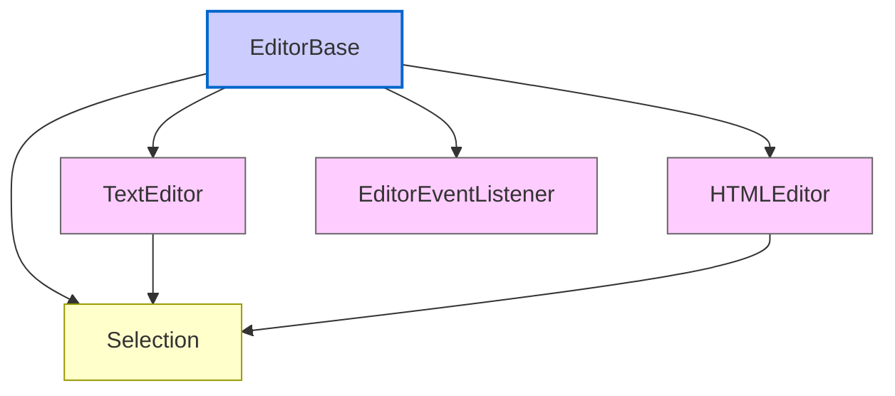
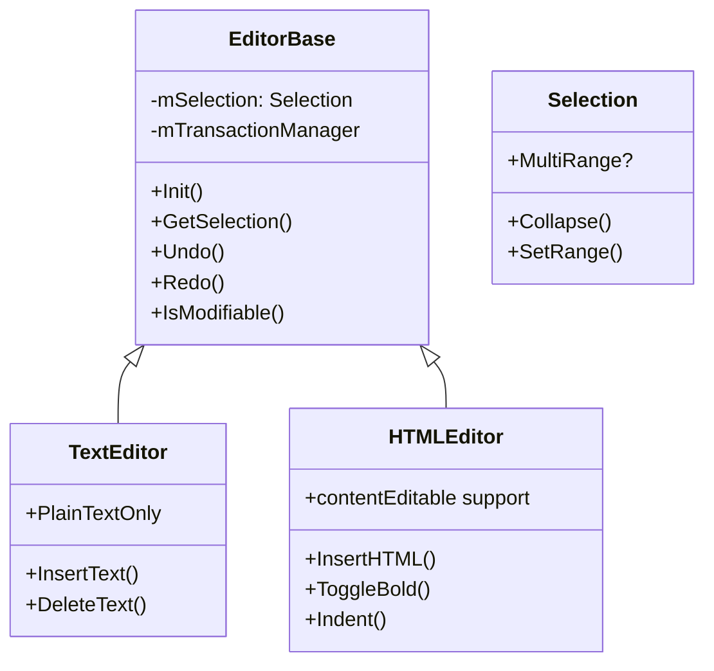
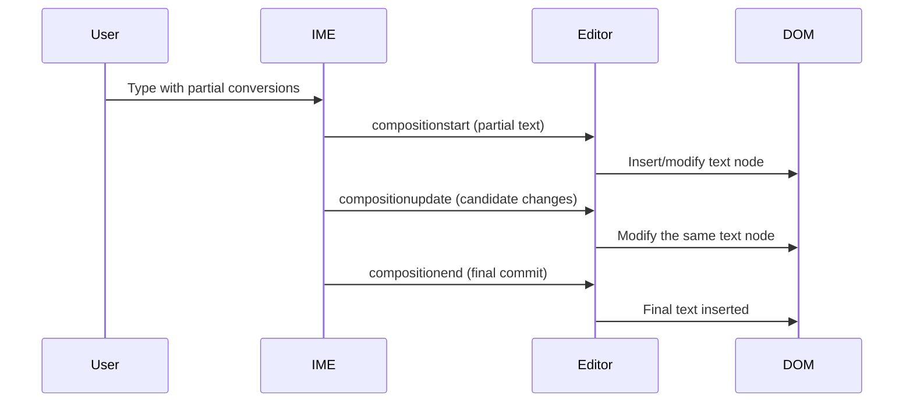

[<< Previous Chapter (The Networking Stack)](./09_networking.md)

# Chapter 10: Editor Module and Text Processing

> **"When a user types into a `<textarea>` or drags text across the screen, the Editor module is the behind-the-scenes maestro: orchestrating DOM manipulation, IME support, selections, undo/redo, and more."**  
> – A developer who spent a week fixing an obscure composition bug

## 10.1 Overview

Welcome to **Chapter 10**, focusing on Firefox’s **Editor Module**—the core engine powering text editing in `<textarea>`, `<input>`, and **contentEditable** elements. This system intersects with **DOM** (Chapter 5), **Layout** (Chapter 6), and **JavaScript** (Chapter 8), providing a robust framework for user text input, keyboard events, selection mechanics, IME composition, and advanced text processing.

We’ll cover:

1. **Editor Architecture**: Key classes (`HTMLEditor`, `TextEditor`, `EditorBase`), module layering, interactions with the DOM.  
2. **Selection & Ranges**: The central mechanism for highlighting, caret placement, and multi-range selections.  
3. **IME Integration**: How partial compositions, East Asian input, and complex scripts tie in.  
4. **Undo/Redo & Transactions**: The system that logs editing actions so users can revert or reapply them.  
5. **Copy/Paste**: Implementation details, OS clipboard usage, plus advanced HTML or rich-text copying.  
6. **Spellchecking & Language Tools**: Where the editor hooks into dictionaries, underlines misspelled words, etc.  
7. **contentEditable & execCommand**: Legacy API surface vs. modern approaches.  
8. **Fission**: Cross-process text editing scenarios, iframes, remote documents, and potential complexities.  
9. **Performance & Debugging**: Minimizing reflows, logging, advanced DevTools for text editing.  
10. **Future Directions**: Next-gen editor APIs, potential rewriting or integration with web standards (Input Events, etc.).

Strap in—text editing is more complicated than you might think.

---

## 10.2 High-Level Editor Architecture

### 10.2.1 Module Layers

Historically, the **Editor** module sits in `editor/` within mozilla-central. It’s split into:

- **EditorBase**: Common logic for all editors (plain text, HTML).  
- **TextEditor**: For `<textarea>`, `<input>` fields, plain text manipulations.  
- **HTMLEditor**: For `contentEditable`, `<body>` editing, advanced HTML manipulations.  

These classes handle:

- **DOM manipulations** (inserting text nodes, merging them, applying bold or italic).  
- **Selection management** (caret, highlights).  
- **Event hooking** (keyboard events, composition events).  
- **Command architecture** for `execCommand("bold")`, undo/redo, etc.

Below is a broad diagram:

### 10.2.2 Interaction with DOM and Layout

The **Editor** modifies the **DOM**—splitting or merging text nodes, inserting `<b>` tags for bold. Layout must track these changes in real-time. For large text, repeated manipulations can cause performance bottlenecks (especially if we trigger layout reflows frequently). Editor code tries to batch operations or use minimal node splits.

---

## 10.3 Selection & Ranges

### 10.3.1 The Concept

**Selection** refers to the user-highlighted region or the caret position (when it’s collapsed). Under the hood, the Editor uses:

- **`Selection`** object: Manages multiple **`Range`** objects. Typically one range for a simple highlight, but multi-range selections are theoretically possible.  
- **`Range`**: Has `(startContainer, startOffset, endContainer, endOffset)`. The Editor queries or updates these as the user moves the caret or modifies text.

### 10.3.2 Carat vs. Focus

When the selection is **collapsed** (start == end), it’s essentially the caret location. The Editor must track the focus node/offset carefully, ensuring keystrokes insert at the correct position. If the user clicks or arrow-keys around, `Selection` updates.

### 10.3.3 Layout Collaboration

The **frame** code calculates the caret’s X/Y position for blinking, or line breaks. The Editor requests layout to ensure the caret is scrolled into view. If Fission splits a document into multiple processes, remote frames might track their own selections, though typically editing is local to a single document realm.

---

## 10.4 IME (Input Method Editor) Support

### 10.4.1 The Challenge

For East Asian scripts (Chinese, Japanese, Korean) and other complex languages, a user types partial compositions. The Editor must display interim text, highlight it, let the IME transform it into final characters, or revert. This is more complex than a simple typed character.

### 10.4.2 Composition Events

**Gecko** dispatches events like `compositionstart`, `compositionupdate`, and `compositionend`. The Editor listens for these:

1. **compositionstart**: Editor sets up a composition string (partial text node).  
2. **compositionupdate**: As the user picks different conversion candidates, the Editor updates that partial text.  
3. **compositionend**: The final text is committed. If the user cancels, the partial text is removed or restored.

### 10.4.3 Cross-Process?

Mostly, IME composition is local to the content process where the editable field lives. With Fission, if an iframe is remote, the OS-level IME events route to that content process. The parent process sees only the final result if needed.

---

## 10.5 Undo/Redo & Transaction System

### 10.5.1 Transaction Model

The Editor logs changes as **transactions**. For instance:

- **InsertTextTransaction**: Insert a substring at a given position.  
- **DeleteTextTransaction**: Remove a substring.  
- **SplitNodeTransaction**, **JoinNodeTransaction**: For node merges or splits.

When the user hits **Ctrl+Z**, the Editor replays these transactions in reverse:

- Inserting text is undone by removing it.  
- Splitting nodes undone by joining them again, etc.

When the user does **Ctrl+Shift+Z** or **Ctrl+Y**, it re-does the transactions. This system also helps preserve state if the user repeatedly toggles bold or merges multiple steps.

### 10.5.2 Midas/execCommand

The legacy `document.execCommand()` triggers various Editor commands—like `"bold"`, `"italic"`, `"undo"`, `"redo"`. Under the hood, the Editor processes these as transactions. Modern frameworks often do custom editing, but many sites still rely on `execCommand("paste")` or `execCommand("insertText")`.

---

## 10.6 Copy/Paste & OS Clipboard

### 10.6.1 The Flow

When a user copies text:

1. The **Editor** checks the current selection (ranges).  
2. It serializes the text or HTML, depending on the context (plain text vs. rich text in contentEditable).  
3. It calls into the system clipboard manager, setting the data.  

For paste:

1. The Editor reads from the clipboard, often multiple formats (plaintext, HTML).  
2. It picks the best format for the target (if it’s an HTML editor, it may parse the HTML).  
3. It inserts at the caret, possibly merging text nodes.

### 10.6.2 Security & Permissions

Modern specs introduced the **Async Clipboard API** (`navigator.clipboard.writeText()`), requiring user gestures for writes or reads. The Editor also respects user or OS-level policies (like blocking paste in certain contexts). In multi-process, the parent or widget code might handle actual clipboard calls, with the Editor requesting them asynchronously.

### 10.6.3 Rich-Text & Sanitization

If you copy from a webpage with complex HTML formatting, the Editor might store that entire HTML chunk. On paste, it could sanitize or strip some tags if the site enforces a simpler subset. This is crucial for preventing XSS or layout-breaking content in chat apps, wikis, etc.

---

## 10.7 Spellchecking & Language Tools

### 10.7.1 Integration with the Editor

A separate module often handles **spellchecking** (dictionary lookups, underlining mistakes). The Editor cooperates:

- Each time text changes, the Editor notifies the spellchecker.  
- The spellchecker identifies misspelled ranges, the Editor draws red underlines (via specialized layout or decorations).  
- Right-click context menus to correct words.

### 10.7.2 Dictionaries & Platform

Firefox can have multiple dictionaries installed. The Editor chooses the language from user preferences or `<html lang="...">`. Spellchecking might be disabled for certain fields (like password or code blocks). All these tie into Editor-level flags.

### 10.7.3 Grammar Checking?

Firefox historically focused on spellchecking. Full grammar checking is rare or add-on-based. If grammar checkers exist, they might integrate similarly to how the spellchecker does, hooking Editor events.

---

## 10.8 contentEditable & execCommand

### 10.8.1 contentEditable Basics

Setting `contentEditable="true"` on an element makes it user-editable. The Editor is attached to that element’s subtree. Key aspects:

- **DOM-based** editing: Pressing Enter inserts ` ` or `
`, pressing backspace merges text nodes.  
- **Selection** is in that element’s range, not the entire document.  
- Script can query `document.queryCommandState("bold")` or run `document.execCommand("bold")` if needed.

### 10.8.2 Complexity and Incompatibilities

Different browsers historically had varying behaviors for contentEditable. Some inserted `
` on Enter, others `
` or ` `. Firefox has many code paths to handle legacy behaviors or quirks. Large frameworks like TinyMCE or CKEditor often override built-in editing with custom JavaScript logic for consistency.

### 10.8.3 Modern Alternatives: `contenteditable="plaintext-only"` or `execCommand` Deprecation?

The web community has discussed deprecating `execCommand`. Some new APIs, like the **Input Events** specification, allow finer-grained control. Firefox partially supports `beforeinput` events, giving script direct control over edits. Still, the Editor module must maintain backward compatibility with `execCommand` for countless legacy sites.

---

## 10.9 Fission: Cross-Process Editing

### 10.9.1 Remote Frames

If a cross-origin iframe is contentEditable, or if it hosts a doc with editable areas, that content process handles editing. The main doc can’t directly see or manipulate the child’s Editor state unless the same-origin policy allows it. Communication might happen via `postMessage`. The local Editor in that process is responsible for IME, selection updates, etc.

### 10.9.2 Security and Isolation

Site isolation helps ensure a malicious editor or script can’t read or write data from another site’s editable frame. Each process has separate memory for Editor structures. The parent or other frames only see sanitized events if they’re allowed.

### 10.9.3 Multi-Window Collaboration

In some advanced scenarios (like collaborative editing?), each user has a different process or even a different device. The Editor might rely on WebSockets or service workers for concurrency. That’s more about application logic than the Editor module itself, but Fission ensures each origin’s Editor is isolated if needed.

---

## 10.10 Performance & Debugging

### 10.10.1 Minimizing Reflows

Editor operations can fragment text nodes if done naively. For instance, every keystroke might create or merge nodes. Repeated merges can trigger layout reflows. Editor code attempts to handle multiple edits in a single batch or transaction, reducing thrash.

### 10.10.2 Logging

**`MOZ_LOG=editor:5`** can produce verbose logs of Editor actions. For composition events, selection changes, or node splits, you’ll see step-by-step logs. This is invaluable for diagnosing tricky issues like “Why did the caret jump to the next line?”

### 10.10.3 DevTools?

Firefox DevTools is somewhat limited in debugging Editor internals. You can see events, selection ranges, but not a specialized “Editor Inspector.” Some add-ons or advanced builds might add more granular tools. Otherwise, you rely on logs, breakpoints in `editor/` code, or plain old `printf` debugging in local builds.

### 10.10.4 Large Documents

If the user loads a massive HTML doc with thousands of lines of text in a contentEditable area, performance can degrade. The Editor might do partial scanning for line breaks, or degrade features like real-time spellchecking. Minimizing node complexity or using virtualization can help.

---

## 10.11 War Stories: Editor Bugs

1. **Double-Composition**: A bug where partial IME text got committed twice on compositionend, duplicating characters. Root cause: a race in handling composition events vs. user key events. Fix: unify the event queue and ensure only one composition is recognized at a time.  
2. **Random Bold**: A site used `execCommand("bold")` on every keystroke for a custom style, causing nested `<b>` tags. Over time, the markup ballooned. The user discovered thousands of nested tags around each sentence. The solution was a custom style toggling approach.  
3. **Undo Fiasco**: The Editor stored thousands of insert/delete transactions, causing memory bloat if the user typed a novel without reloading. The fix was capping the undo stack or merging consecutive insert transactions.  
4. **Clipboard Security**: A malicious site tried calling `execCommand("paste")` in an auto-run script, prompting the user for permission. A bug let it bypass the prompt in certain old builds. That was swiftly patched to ensure user gesture checks.  

---

## 10.12 Diagrams Galore

### 10.12.1 Editor Class Structure

### 10.12.2 Composition Flow

---

## 10.13 Future Directions

1. **Input Events**: A W3C spec giving granular “beforeinput” hooks. Firefox partially implements it. Over time, it might replace or augment `execCommand`.  
2. **Better Collaboration Tools**: Possibly hooking Editor for real-time shared editing (like Google Docs). That might require robust concurrency handling.  
3. **Refactor**: The Editor code is old and can be complex. Periodic refactoring tries to unify HTML and text editing logic.  
4. **Better Mobile/Touch**: Handling selection drags, virtual keyboards, and auto-correction. The Editor still has improvements to make for touchscreen ergonomics.

---

## 10.14 Conclusion

This Chapter on the **Editor Module** should leave you well-versed in:

- **EditorBase** vs. **TextEditor** vs. **HTMLEditor**.  
- **Selection & Ranges**: The backbone of caret placement, highlighting, and user editing operations.  
- **IME & Composition**: Handling partial text for complex scripts.  
- **Undo/Redo**: Transaction-based system for reversing edits.  
- **Copy/Paste**: Interfacing with OS clipboards, handling HTML vs. text data.  
- **Spellchecking**: Integration for underlined mistakes.  
- **contentEditable**: The built-in HTML editing mode, plus its many quirks.  
- **Fission**: Each content process handles its own Editor, ensuring site isolation.  
- **Performance & Debugging**: Logging, grouping edits, watching out for large docs.  
- **Future**: Input Events, possible rewrites, deeper tooling.

Having delved into the **Editor** and text processing, we’ve covered most major subsystems in Firefox. Further chapters may handle **Security & Sandboxing**, **Debugging** advanced techniques, or any specialized modules left in the pipeline. Keep exploring—the web engine is vast!

---

[Next Chapter >> (Performance Profiling and Tooling)](./11_performance.md)
