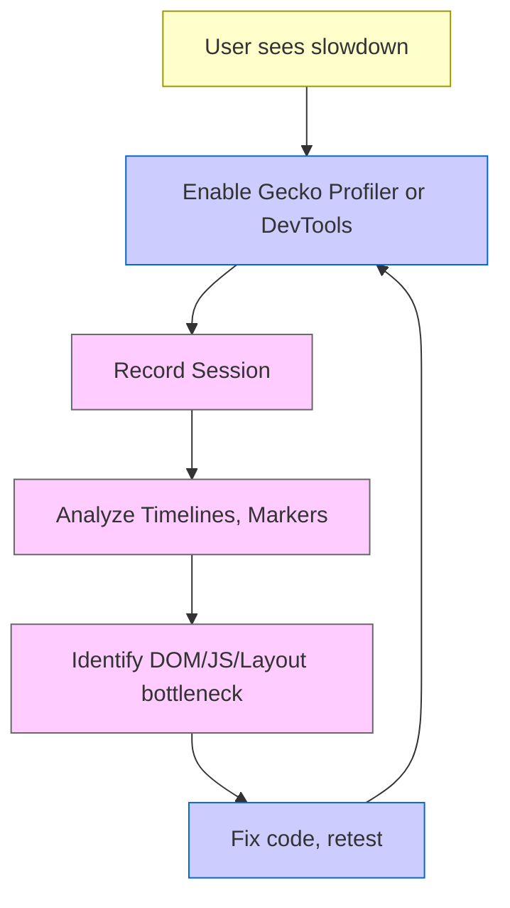

# Chapter 11: Performance Profiling and Tooling

[<< Previous Chapter (Editor Module and Text Processing)](./10_editor.md)

> **“If you can’t measure it, you can’t optimize it. Profiling helps us pinpoint those hidden bottlenecks across DOM, layout, JS, and networking.”**  
> – A staff engineer explaining why every slowdown has a story

## 11.1 Overview

Now that we’ve explored **DOM**, **Layout**, **CSS**, **JS**, **Networking**, and **Editor**, let’s focus on **Performance Profiling and Tooling**. Firefox/Gecko is a sprawling codebase, and performance can degrade in countless ways—**layout thrashing**, **JIT bailouts**, **network overhead**, **DOM leaks**, or **massive style recalculations**. In this chapter, we’ll examine:

1. **Profilers**: The built-in Gecko Profiler, external tools (`perf`, `Instruments` on macOS, etc.).  
2. **Performance Markers**: Logging, specialized instrumentation for layout reflows, GC cycles, or network requests.  
3. **Memory Profiling**: `about:memory`, cycle collector logs, how to read them.  
4. **Performance Tools & Panels**: DevTools Performance panel, real-time FPS counters, etc.  
5. **Advanced Instrumentation**: Event tracing, scheduling, concurrency debugging.  
6. **Fission**: Multi-process performance analysis, bridging data from socket/parent/content processes.  
7. **Case Studies**: Real-world examples of discovering slowdowns in JS vs. layout vs. editor.  
8. **Best Practices**: Minimizing overhead in each subsystem, measuring and optimizing with a data-driven approach.

By the end, you’ll know how to **pinpoint bottlenecks** in a massive browser environment and systematically address them.

---

## 11.2 Profilers and Frameworks

### 11.2.1 The Gecko Profiler

Firefox ships a built-in **Gecko Profiler**, accessible via:

- **about:config** (`devtools.chrome.enabled`, `devtools.debugger.remote-enabled`)  
- **about:profiling** page for advanced config  
- The **Firefox Profiler** add-on or integrated toolbar button

It samples call stacks across **C++**, **JavaScript**, and **Rust** code at intervals (e.g., every 1 ms). You can visualize results at **profiler.firefox.com**.

**Key Features**:

1. **Multi-Thread** capture: Main thread, compositor thread, DOM worker threads, etc.  
2. **Markers**: The engine automatically adds markers for GC, reflows, painting. Devs can add custom markers (via `profiler_add_marker(...)`).  
3. **Symbolication**: Matches addresses to function names if debug symbols are available.  

### 11.2.2 External Profilers

- **Linux**: `perf`, `sysprof`, `Valgrind` (for memory or CPU profiles), `callgrind`.  
- **macOS**: Instruments (Time Profiler, Allocations, etc.).  
- **Windows**: Visual Studio Performance Profiler, ETW-based tools.  

These tools operate at the OS level, so they might see more system calls or CPU scheduling details. However, they might not decode Gecko’s internal markers as neatly as the Gecko Profiler does.

### 11.2.3 `rr` (Record & Replay)

While **`rr`** is primarily a debugger, it also has a time-travel aspect that can help with performance. You can record execution, measure instruction counts or events, and replay to pinpoint exact code paths. It’s especially helpful for concurrency or race conditions.

---

## 11.3 Performance Markers and Instrumentation

### 11.3.1 Built-In Markers

**Gecko** adds markers for:

- **DOM Event** dispatches  
- **Layout Reflow** phases  
- **GC/CC** slices (start, end)  
- **Compositor** tasks (layer building, painting)  
- **Networking** milestones (HTTP transaction start/end)

When you open a Gecko Profiler capture, you’ll see these markers on a timeline. They help correlate CPU usage with events.

### 11.3.2 Adding Custom Markers

Developers can insert custom markers in C++ or JS:

- **C++**: `profiler_add_marker("MyMarker", ...);`  
- **JS**: `ChromeUtils.addProfilerMarker("MyMarker", {...});`

This is crucial if you have a specialized subsystem or want to measure specific code blocks.

### 11.3.3 Idle/Background Tasks

Firefox schedules tasks in idle time to avoid main-thread jank. Markers can show when idle tasks run, letting devs see if background tasks unexpectedly block more critical operations.

---

## 11.4 Memory Profiling

### 11.4.1 about:memory

**`about:memory`** is a built-in page that breaks down memory usage by:

1. **Process**: Parent, content1, content2, GPU, socket, etc.  
2. **Subsystem**: JS, DOM, layout, style, editor, etc.  
3. **Heap**: Committed, mapped, overhead, etc.

You can **measure** or **save** a verbose report. It shows categories like `explicit/js/nursery` or `explicit/dom/window-objects`.

### 11.4.2 Cycle Collector Logs

If you suspect a DOM or Editor memory leak, enable environment variables (like `XPCOM_CC_LOG`) to produce logs of references. This shows each node/object and what references it. You can parse these logs to find cycles that never get collected, typically by searching for objects with no external roots that remain reference-bound in a cycle.

### 11.4.3 SpiderMonkey GC Stats

The JS engine can produce logs of GC times, GC slices, reasons for GC (e.g., “allocation trigger,” “compartment threshold”). If you see repeated GCs or high times, you might have many short-lived objects or a memory fragmentation issue.

---

## 11.5 DevTools Performance Panel

### 11.5.1 Real-Time Recording

Open **DevTools -> Performance** and start recording:

- **Timeline**: CPU usage, frame rate, memory usage, plus event markers (layout, script, GC).  
- **Flame Chart**: A high-level or advanced call stack representation, though it may not be as detailed as the Gecko Profiler.  
- **Screenshots**: If enabled, see how the page looks at each stage.

### 11.5.2 Analyzing Script vs. Layout

The panel can break down how much time is spent in:

- **Script**: JS execution, function calls, event handlers.  
- **Layout**: Reflow, style recalc.  
- **Paint/Composite**: Drawing or updating layers in the GPU process.  

This is often enough for typical web dev debugging. For deeper engine-level performance, the **Gecko Profiler** or external tools remain more powerful.

---

## 11.6 Advanced Instrumentation: Tracing and Scheduling

### 11.6.1 Tracing Framework

Mozilla occasionally uses a tracing framework (some dev builds or specialized branches) that logs function calls or partial execution paths. This can be correlated with the profiler or system logs to see scheduling decisions.

### 11.6.2 Task Scheduling & Priority

Firefox uses **`nsThread`** / **`TaskController`** to schedule runnables across threads. If performance is poor, you might see tasks queued behind a long-running operation. Tools like the **Gecko Profiler** can show you a “runnable” queue. Fission complicates scheduling because multiple content processes each have their own queue, plus the parent or socket process.

### 11.6.3 GPU and Compositor Traces

For graphics bottlenecks (like slow WebGL draws, repeated painting of large areas), logs from the **GPU process** or WebRender can reveal how many polygons or layers are being rendered. Tools like `WebRender debug flags` can highlight slow paths.

---

## 11.7 Fission: Multi-Process Performance

### 11.7.1 Cross-Process Profiling

When Fission splits content across processes, the **Gecko Profiler** or DevTools must gather data from each. The final timeline merges them. If you see a main-thread spike in content1 process while content2 is idle, you can correlate that with user interactions or site scripts in content1.

### 11.7.2 Parent/Socket Bottlenecks

Sometimes the **parent** or **socket** process becomes the bottleneck—like a high-latency networking scenario. If the parent is pegged by many IPDL messages from multiple content processes, you’ll see a queue forming. The profiler can show heavy usage in `ipc::MessagePump`, or frequent message dispatch. This might require balancing or deferring certain tasks.

### 11.7.3 Splitting & Overhead

Fission can reduce or increase performance overhead depending on user scenarios. More processes can parallelize tasks but also add IPC overhead. Profiling helps you see if you’re sending too many cross-process calls. A single function that calls into a remote process 100 times per second can degrade performance significantly.

---

## 11.8 Real-World Examples (Case Studies)

1. **Layout Thrash**: A dev found repeated reflows triggered by a script that toggled a CSS class in a loop. The profiler showed many “reflow” markers close together. Fix: batch DOM changes or use transform-based animations.  
2. **JIT Bailouts**: The Gecko Profiler timeline revealed IonMonkey bailouts. Inspecting logs showed the code used dynamically typed arrays or changed object shapes frequently. The dev stabilized object shapes, halving runtime.  
3. **Excessive GC**: `about:memory` logs indicated JS used 90% of memory in the nursery. The app created thousands of short-lived objects. A solution was reusing object pools or letting the engine do partial incremental GCs more frequently.  
4. **Network Bottleneck**: The DevTools Network panel found 100s of small fetches. The site consolidated them into fewer requests or used HTTP/2 push, drastically speeding load times.

---

## 11.9 Best Practices for Performance

1. **Measure First**: Don’t guess. Use the Gecko Profiler or DevTools to find actual bottlenecks.  
2. **Minimize Recalc**: Group DOM writes, keep your style usage efficient, avoid thrashing.  
3. **Optimize Script Patterns**: Keep objects monomorphic, avoid repeated shape changes.  
4. **Use Caching**: Both HTTP caching and SW caching. Don’t fetch the same resource repeatedly.  
5. **Be Wary of Cross-Process**: If using remote frames, avoid spamming IPC calls or bridging events too frequently.  
6. **Tune GC**: Keep an eye on short-lived objects. Possibly break large data sets into smaller chunks.  
7. **Keep Dependencies Lean**: Large frameworks or multiple style sheets can slow both style and layout.

---

## 11.10 Diagrams: Profiling Workflow

---

## 11.11 Conclusion

This Chapter illuminates **Performance Profiling and Tooling** in Firefox:

- **Profilers**: Gecko Profiler, external OS tools, `rr`, plus markers for GC, layout, etc.  
- **Memory Tools**: `about:memory`, cycle collector logs, JS GC stats.  
- **DevTools**: Performance panel for simpler measurements, timeline breakdown.  
- **Fission**: Multi-process complexities, bridging data from parent/socket to content.  
- **Case Studies & Best Practices**: Real examples of diagnosing layout thrash, JS bailouts, memory usage, network overhead.

Armed with these tools, you can systematically measure and optimize each subsystem for a smoother, more efficient Firefox. Next, we move into **[Chapter 12: Security and Sandboxing](./12_security.md)**, exploring how Firefox protects users from malicious code via process isolation, sandbox levels, and advanced security policies.

---

[Next Chapter >> (Security and Sandboxing)](./12_security.md)

---
