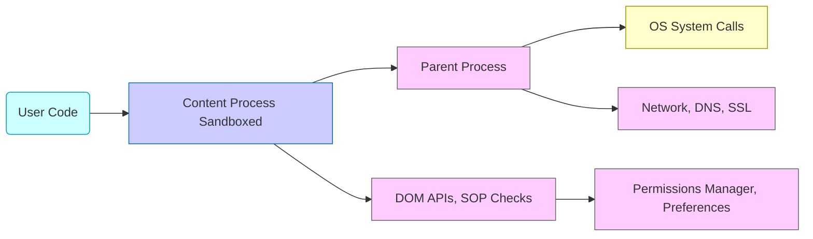

# Chapter 12: Security and Sandboxing

[<< Previous Chapter (Performance Profiling and Tooling)](./11_performance.md)

> **“A browser is a fortress that runs untrusted code from around the world. Security is the rampart that keeps it from pillaging your system.”**  
> – A security engineer discussing why multi-process sandboxing is crucial

## 12.1 Overview

Welcome to **Chapter 12**, a look into **Security and Sandboxing** in Firefox. Browsers face constant threats—malicious scripts, exploits, cross-site attacks, or vulnerabilities in OS drivers. Firefox employs **multiple layers** of defense:

1. **Same-Origin Policy**: Core to DOM and script isolation.  
2. **Sandboxing**: Splitting code into locked-down processes with limited OS privileges.  
3. **Permissions**: Controlling APIs like geolocation, camera/microphone.  
4. **Mixed Content Blocking**: Ensuring secure pages aren’t compromised by insecure subresources.  
5. **Site Isolation (Fission)**: Each origin in a separate process to contain exploits or side-channel leaks.  
6. **Add-on Security**: WebExtensions with limited privileges, code signing.  
7. **TLS/SSL**: Ensuring data in transit is encrypted and validated.  
8. **Advanced Hardening**: ASLR, Control Flow Integrity, etc.

By the end, you’ll see how these mechanisms interplay, forming a robust (though never perfect) security posture.

---

## 12.2 Same-Origin Policy (SOP) and Cross-Origin

### 12.2.1 The Foundation

**SOP** prevents a site’s scripts from accessing data in another site’s DOM or other resources unless explicitly allowed (CORS, postMessage, etc.). For instance:

- `document.cookie` is partitioned by domain.  
- `iframe.contentWindow` from another origin is mostly blocked for direct property access.

### 12.2.2 PostMessage & CORS

- **postMessage**: A cross-document messaging API that safely serializes data.  
- **CORS**: Cross-Origin Resource Sharing uses headers (`Access-Control-Allow-Origin`) to permit controlled data sharing. Without them, the request fails or is blocked.

### 12.2.3 Fission Impact

Under Fission, each origin can be in a distinct process, physically preventing a script from reading the memory space of another origin’s document. SOP in the code remains, but now hardware boundaries (process separation) reinforce it even if there’s a bug in the DOM or JS engine.

---

## 12.3 Process Sandboxing

### 12.3.1 Why Sandbox?

A compromised content process shouldn’t escalate to read user files or OS credentials. Each **content process** has restricted OS privileges—**no direct disk access** beyond cache directories, for instance.

### 12.3.2 Sandboxing Levels (Windows, Linux, macOS)

Firefox uses **sandbox levels**:

- **Level 0**: Minimal sandboxing (debug/dev builds).  
- **Level 1-2**: Some limitations on system calls.  
- **Level 3+**: Heavily restricted. On Windows, it uses **Job Objects**, **AppContainer**. On Linux, **seccomp-bpf** filters to block dangerous syscalls. macOS uses **Sandbox Profiles**.  

**GPU process** might need more system calls for GPU drivers, so it has a slightly less strict sandbox than the content process. **RDD** (media decoders) also gets a specialized sandbox (some code needs hardware-accelerated video decoders).

### 12.3.3 Fission Processes

Under Fission, each site’s content process has an OS-level sandbox. If the site is compromised, it can only read or write within its sandbox’s limited environment. The parent or socket process that handles networking has separate constraints, carefully bridging data but not letting content processes directly manipulate OS resources.

---

## 12.4 Mixed Content and Secure Contexts

### 12.4.1 Mixed Content Blocking

If an HTTPS page tries to load an HTTP script (`<script src="http://...">`), it’s **blocked** by default:

- **Active Content** (scripts, iframes) is blocked.  
- **Passive Content** (images) might be allowed or optionally blocked.  

This ensures a malicious MITM can’t inject code through an unprotected subresource.

### 12.4.2 Secure Context Requirements

APIs like **Geolocation**, **Service Workers**, or **WebAssembly streaming** often require a **secure context** (HTTPS). Without HTTPS, they’re unavailable or produce warnings. This encourages site owners to deploy TLS everywhere.

### 12.4.3 Upgrading Insecure Requests

Some pages use `upgrade-insecure-requests` in Content Security Policy to rewrite `http://` resources to `https://`. This helps transition older sites to fully HTTPS. If the resource fails on HTTPS, it might not load at all, but better that than silent MITM.

---

## 12.5 Permissions and Privacy

### 12.5.1 Permissions Manager

**Firefox** stores user permissions for camera, microphone, notifications, geolocation, etc. If a site requests `navigator.geolocation.getCurrentPosition()`, a permission prompt appears. The permissions manager logs the user’s choice, so next time the site doesn’t re-prompt.

### 12.5.2 Tracking Protection

Firefox has **Enhanced Tracking Protection** to block known trackers, cookies, or scripts from third-party domains flagged as trackers. This merges security and privacy, using lists from entities like Disconnect. The browser may block certain requests or data storage. This can hamper some site functionality but improves user privacy.

### 12.5.3 Container Tabs

**Container Tabs** isolate cookies, local storage, or site data per container. This is a user-facing feature for privacy. Implementation hooks into the networking and storage logic, ensuring each container has a distinct cookie jar. Attackers or trackers can’t trivially link user sessions across containers.

---

## 12.6 Content Security Policy (CSP)

### 12.6.1 Basic CSP

**CSP** headers (like `Content-Security-Policy: script-src 'self' https://apis.example.com`) restrict resource loading to certain domains, or block inline scripts. Firefox enforces these rules:

1. If a script from an unauthorized domain is loaded, the request is blocked.  
2. Inline event handlers might be disallowed unless you allow `'unsafe-inline'`.  
3. Worker creation, or dynamic scripts can also be restricted.

### 12.6.2 CSP 3.0 Features

**Nonces** or **hashes** for scripts help ensure only authorized inline code runs. Firefox checks the specified nonce or hash. If it doesn’t match, the script is blocked. This drastically reduces XSS risk.

### 12.6.3 Reporting

Firefox can send CSP violation reports to a specified endpoint. Devs can track and fix issues or see if an attacker tried injecting scripts. The dev must set `report-uri` or `report-to` in CSP headers.

---

## 12.7 Add-On Security (WebExtensions)

### 12.7.1 WebExtensions Architecture

Modern Firefox add-ons use **WebExtensions** with a limited API. The extension runs in a separate process or environment, obtains only declared permissions (like “tabs”, “storage”), can’t call native OS APIs directly, and must pass extension reviews or signing.

### 12.7.2 Signing and AMO

Add-ons must be **signed** by Mozilla’s Add-ons site (AMO) or an enterprise policy. Unsigned add-ons are blocked in release builds. This prevents malicious distribution. Dev or Nightly builds can allow unsigned add-ons for testing.

### 12.7.3 Legacy XUL Add-Ons

Older XUL-based add-ons had deep access to internals. They’re mostly deprecated since Firefox Quantum (~2017). Security was a key reason for shifting to WebExtensions—no more hooking random XPCOM or rewriting internal code.

---

## 12.8 Advanced Hardening and Techniques

### 12.8.1 ASLR, CFG

Modern OSes use **Address Space Layout Randomization** (ASLR) to randomize code sections. **Control Flow Guard** (Windows) or other **CFI** techniques help mitigate ROP/JOP exploits. Firefox tries to be compatible with these features.

### 12.8.2 Rust Components

Servo-based **Stylo** and **WebRender** are written in Rust, leveraging memory safety. This reduces the risk of buffer overflows or use-after-free vulnerabilities in crucial code paths like CSS matching or GPU rendering.

### 12.8.3 Security Reviews and Bug Bounties

Mozilla invests in **security bug bounties**, plus an internal security team that reviews changes, especially in critical areas (Network code, XPCOM, JS engine). They also maintain **in-tree fuzzers** (like `jsfunfuzz`, `DOM fuzzing`) to discover vulnerabilities before release.

---

## 12.9 Fission and Security Gains

### 12.9.1 Site Isolation

We’ve mentioned Fission extensively:

- Each origin or cross-origin iframe in its own process.  
- Memory corruption in one content process can’t read another origin’s data.  
- Zero cross-origin direct memory references.

### 12.9.2 Secure IPC Boundaries

Even if an attacker executes code in a content process, their scope is the sandbox. They can’t call OS APIs or read OS files beyond what’s whitelisted. IPDL messages must pass validation in the parent. This drastically limits exploit damage.

### 12.9.3 Granular Permissions per Origin

The parent process might store per-origin camera/microphone permissions. If a cross-origin subframe requests the microphone, Fission ensures that subframe’s process is recognized as a distinct site. The user sees a prompt referencing that origin, not the top-level site. No more hidden sub-iframe capturing audio.

---

## 12.10 Debugging and Auditing

### 12.10.1 DevTools Security Panel?

Firefox DevTools has partial security features (like showing if a page is secure, if subresources are blocked). A dedicated “Security Panel” can show TLS info, CSP, or mixed content status.

### 12.10.2 about:config Flags for Security

- **`privacy.resistFingerprinting`**: Reduces or randomizes certain APIs.  
- **`network.stricttransportsecurity.preloadlist`**: Toggling HSTS preload usage.  
- **`security.sandbox.content.level`**: On Windows or Linux, sets the content sandbox level.

Tweak these carefully—some might break site functionality.

### 12.10.3 Logs & Crash Reports

When a sandbox blocks an action, logs might appear in `MOZ_LOG=Sandbox:5`. If a content process crashes from a security kill, Crash Reporter logs it. The stack can reveal an attempted illegal syscall—**seccomp** can kill the process gracefully.

---

## 12.11 War Stories: Security Issues

1. **Credential Theft**: An older bug let cross-origin iframes read top-level cookies if specific legacy features were enabled. Patched quickly with stricter checks in the cookie code + site isolation.  
2. **Plugin Crash**: A compromised plugin tried to call OS APIs to write to arbitrary files. The NPAPI plugin sandbox blocked it. The plugin crashed, but user data stayed safe.  
3. **Spectre/Meltdown**: Even with site isolation, CPU side-channel attacks threatened cross-origin data. A series of mitigations (JS JIT hardening, reduced precision in timers) were deployed.  
4. **Add-On Escalation**: A malicious extension bypassed signing checks in an older ESR build. It installed system-level hooks. The fix forced all ESR versions to verify signatures or block the extension entirely.

---

## 12.12 Diagrams: Security Layers

---

## 12.13 Best Practices for Security

1. **Keep Dependencies Updated**: Old libs or engines can have known exploits.  
2. **Enable Highest Sandbox Level**: Unless debugging, keep content sandbox at maximum feasible.  
3. **HTTPS Everywhere**: Deploy HSTS, block insecure subresources.  
4. **Validate All IPC**: In new code, ensure parent checks data from content for correctness.  
5. **Review PRs**: Security code or DOM changes should get thorough review from specialists.  
6. **Fuzz**: Use fuzzers to discover memory issues in JS or layout code.  

---

## 12.14 Conclusion

In this Chapter on **Security and Sandboxing**, we explored:

- **Same-Origin Policy, CORS, postMessage**: The backbone of web security in the DOM.  
- **Process Sandboxing**: OS-level restrictions on content, GPU, RDD processes.  
- **TLS, Mixed Content**: Encrypted data, blocking insecure subresources.  
- **Permissions/Privacy**: Cameras, geolocation, tracking protection, container tabs.  
- **CSP**: Restricting resource loads, mitigating XSS.  
- **Add-on Security**: WebExtensions with limited privileges and code signing.  
- **Advanced Hardening**: Rust code, memory safety, exploit mitigations.  
- **Fission**: Site isolation to prevent cross-origin data leaks.  
- **Debugging & War Stories**: Real examples of exploit attempts, postmortems.  

Next, we move to **[Chapter 13: Debugging Like a Pro](./13_debugging.md)**, detailing advanced debug techniques—`gdb`, `lldb`, `rr`, DevTools, symbol servers, and how to handle the labyrinth of multi-process, multi-threaded code in Firefox.

---

[Next Chapter >> (Debugging Like a Pro)](./13_debugging.md)
