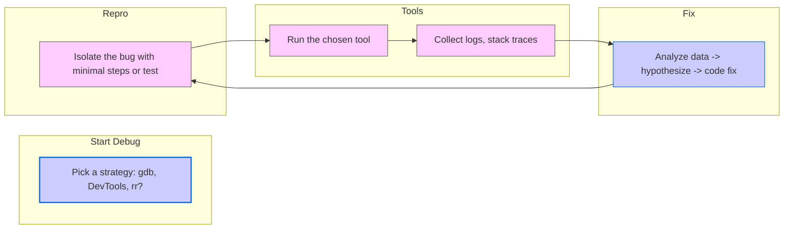

[<< Previous Chapter (Security and Sandboxing)](./12_security.md)

# Chapter 13: Debugging Like a Pro

> **"Debugging a multi-million-line, multi-process codebase is like navigating a maze at night—tools like rr or DevTools are your flashlight."**  
> --  A senior developer describing how debugging midnight crashes feels

## 13.1 Overview

Welcome to **Chapter 13**, where we tackle **Debugging**. Firefox is massive: **C++** for the engine, **Rust** for style/compositor, **JavaScript** for front-end or add-ons, plus multi-process complexities (Fission). Debugging requires a robust set of tools, from **gdb** or **lldb** for native code to **DevTools** for web content and JavaScript, plus advanced record-and-replay tools like **rr**. We’ll cover:

1. **Local Native Debugging**: Setting breakpoints, stepping through mach run, analyzing stack traces.  
2. **DevTools Debugger**: JS breakpoints, watchers, stepping, event breakpoints, debugging remote content processes.  
3. **rr** (Record & Replay): Time-travel debugging to track elusive concurrency or JIT bugs.  
4. **Symbol Servers & Crash Reports**: Understanding Socorro, minidumps, and how to retrieve symbolicated stacks.  
5. **Logging & Telemetry**: Using MOZ_LOG, printf_stderr, or advanced telemetry probes.  
6. **Fission Debugging**: Multi-process complexities, debugging remote iframes, bridging parent/child logs.  
7. **Memory Tools**: Valgrind, Address Sanitizer, Leak Sanitizer, identifying use-after-free or memory leaks.  
8. **Best Practices**: Setting up an efficient debugging workflow, nightlies vs. local debug builds, merges, code reviews.

By the end, you’ll have a solid grasp on wrangling this beast of a codebase with minimal tears.

---

## 13.2 Local Native Debugging (C++/Rust)

### 13.2.1 Using mach run and mach debug

When you do:

```bash
./mach run --debug
```

Firefox starts under **gdb** (on Linux) or **lldb** (macOS) or **cdb** / Visual Studio (Windows). You can set breakpoints, for example, break nsDocument::GetElementById. Then proceed to run. If you’re debugging a crash:

1. Reproduce the crash with certain steps.  
2. The debugger halts at the crash site, letting you see the stack, local variables, etc.

You can also run:

```bash
./mach debug --args -P yourProfile -no-remote
```

to pass custom arguments (like a specific profile or config).

### 13.2.2 Attaching to an Existing Process

If Firefox is already running, you can attach a debugger to the correct process ID. On Linux/macOS:

```bash
ps aux | grep firefox
gdb attach <pid>
```

But with Fission or multiple content processes, you might have multiple pids. Tools like about:processes can help identify which process is correct. For advanced debugging, you can attach to the GPU or socket process if that’s where the crash occurs.

### 13.2.3 Rust Debugging

Many components are in Rust (Stylo, WebRender). gdb/lldb can handle Rust code with partial symbol info. For deeper Rust-specific debugging, rust-lldb or rust-gdb can provide better type printing. The build system includes debug info if you compile with --enable-debug and no --disable-debug-symbols.

---

## 13.3 DevTools Debugger (JavaScript + DOM)

### 13.3.1 Debugging Scripts

Open DevTools -> Debugger:

1. See all loaded scripts (page scripts, add-ons, or internal).  
2. Set breakpoints, watchers.  
3. Step through code line-by-line.

Source-mapped scripts appear if source maps are provided (like for TypeScript or Babel code).

### 13.3.2 Debugging Remote Frames (Fission)

If the site uses cross-origin iframes or the code is in a different content process, DevTools must attach to that process. The user sees a unified list of scripts. Under the hood, DevTools spawns remote debugging connections to each content process. If you see "(remote)" or "(tab 2)", that might indicate a separate process. Setting breakpoints still works normally, but behind the scenes is a complex debug protocol bridging processes.

### 13.3.3 Event Listener Breakpoints

You can pause code whenever a certain DOM event fires, e.g., click or keypress. DevTools instruments the event system, so when the event dispatch hits, it triggers a breakpoint. This is invaluable for large codebases with many event handlers.

---

## 13.4 rr Record and Replay Debugger

### 13.4.1 Why rr?

rr is a Linux-only tool that records every instruction and non-deterministic event (like syscalls) so you can replay later. Great for:

- Heisenbugs: Race conditions that vanish if you add print statements.  
- Crashes that are sporadic.  
- Complex multi-thread issues.

During record, rr logs all the process interactions. You then run rr replay to attach gdb, stepping backward or forward in time.

### 13.4.2 Workflow

```bash
rr record ./mach run --debug
# reproduce bug, once crash or done, exit
rr replay
# attach to gdb
```

Now you can do reverse-continue, reverse-step, etc. This time-travel debugging is a game-changer for concurrency or out-of-bounds issues.

### 13.4.3 Integration with Mach

Sometimes devs add mach commands like mach rr --record run. Check local docs or scripts. Note rr can be slower due to overhead, especially with many processes. You might limit or single-process some tasks if possible, or use environment variables to disable GPU or other complexities.

---

## 13.5 Symbol Servers and Crash Reports

### 13.5.1 Crash Reporter

When Firefox crashes, it can generate a minidump plus a crash ID. The user can send it to Mozilla’s servers (Socorro). Devs can retrieve that crash, see a call stack if symbols are available. Locally, you can do:

```bash
./mach crashreporter --run
```

to test crash scenarios or parse local minidumps.

### 13.5.2 Symbolication

Mozilla’s symbol server or local .pdb / .dSYM / .sym files let you map addresses to function names. The crash stack might show xul.dll!0x12345 otherwise. Symbolicating yields nsDocument::GetElementById (nsDocument.cpp:700), for instance. Debug builds produce full symbols, while release builds have stripped symbols but partial references are still possible.

### 13.5.3 Socorro Web Interface

Mozilla’s Socorro site aggregates crash reports. Searching by signature can reveal if a crash is widespread or if it’s been happening for a while. You can see correlations (OS version, GPU driver, etc.). This is crucial for triage and prioritizing fixes.

---

## 13.6 Logging and Telemetry

### 13.6.1 MOZ_LOG

A powerful system for per-component logging. For example:

```bash
MOZ_LOG="nsHttp:5,ipc:5,timestamp" ./mach run
```

Generates verbose logs for HTTP and IPC components. Components have short tags (like editor:5, DOMLeak:5, PlatformDecoderModule:5). A debug message at level 5 is extremely verbose.

### 13.6.2 printf or Stderr Logging

Developers often add statements like:

```cpp
printf_stderr("Editor: Merging text nodes at line %d\n", __LINE__);
```

in local builds. This is quick but must be removed or guarded before shipping. That’s why MOZ_LOG is more systematic. You can also do NS_WARNING("some message") or NS_ASSERTION(...).

### 13.6.3 Telemetry

Firefox collects Telemetry for usage metrics, performance, or feature usage. If a user consents, data is aggregated in release builds. For debugging memory or performance issues in the wild, telemetry can hint how widespread an issue is.

---

## 13.7 Memory Tools (Valgrind, ASan, LSan)

### 13.7.1 Valgrind / Memcheck

On Linux, run:

```bash
valgrind --leak-check=full ./mach run
```

This is quite slow but detects memory leaks, invalid reads/writes. Because Firefox is large, expect huge overhead. Some devs do partial runs or specialized builds with debug or certain features disabled.

### 13.7.2 Address Sanitizer (ASan)

A compiler-based approach to instrument memory accesses. Build with:

```bash
ac_add_options --enable-address-sanitizer
```

in your mozconfig. Then if you run ./mach run, the process halts on the first invalid memory access. This is great for detecting buffer overflows or use-after-free. The overhead is lower than Valgrind but still significant.

### 13.7.3 Leak Sanitizer (LSan)

Often combined with ASan, it tracks memory allocations that aren’t freed. If you run a test suite or scenario, at exit, LSan reports unfreed blocks. Some are known false positives or intentionally kept until shutdown, so you may see suppressions in the codebase.

---

## 13.8 Fission Debugging Nuances

### 13.8.1 Multi-Process

With Fission, you might have N content processes, a parent, GPU, socket. Some debugging requires multiple debuggers or conditional breakpoints. The recommended approach:

1. Start parent under gdb/lldb.  
2. Wait for child processes to spawn, attach separate debuggers if needed.

Alternatively, run a single content process if you can replicate the bug without multi-process complexity. Not always possible, but simpler for debugging.

### 13.8.2 Logging IPDL

If you suspect an IPC bug, enable:

```bash
MOZ_LOG="ipc:5,ipdl:5" ...
```

You’ll see message dispatch logs, send/recv, actor lifecycle. For complicated issues, cross-reference with parent logs to see if a message was dropped or arrived out of order.

### 13.8.3 Remote DevTools

DevTools for a cross-origin subframe runs a remote debugging session under the hood. If you suspect a bug in DevTools or the remote protocol, enabling logs for devtools.* might help. Or you can run the Browser Toolbox on the parent UI to see how DevTools communicates with child processes.

---

## 13.9 Best Practices

1. **Use a Debug Build**: --enable-debug plus possibly no optimization for clearer stacks.  
2. **Don’t Overdo Logging**: The engine can spam logs at level 5, degrading performance.  
3. **Focus on Repro Steps**: Minimally reproduce the bug, removing extraneous code.  
4. **Be Systematic**: Check about:memory, run partial tests, use rr record. Large code changes can shift race conditions.  
5. **Document**: If you find an obscure bug, add notes or comments for future devs.

---

## 13.10 Diagrams: Debug Flow



---

## 13.11 Conclusion

In this **Chapter 13**, we’ve explored **Debugging Like a Pro**:

- **Local Debugging** with mach debug, breakpoints in C++/Rust.  
- **DevTools** for JS code, event breakpoints, remote frames.  
- **rr** for record-and-replay, time-travel debugging.  
- **Crash Reports & Symbol Servers**: Socorro, minidumps, symbolication.  
- **Logging**: MOZ_LOG, printing, telemetry.  
- **Fission**: Multi-process complexities, bridging IPDL logs.  
- **Memory Tools**: Valgrind, ASan, LSan for memory corruption hunts.  
- **Best Practices** for systematic bug triage.

With debugging in your toolkit, you're ready to fix or refine engine code. We’ll proceed to more specialized chapters like Contributing to Firefox (Chapter 14) or Large-Scale C++ Maintenance (Chapter 15). You’re on the home stretch of exploring Gecko’s internals—keep going!

---

[Next Chapter >> (Contributing to Firefox and Gecko)](./14_contributing.md)
