[<< Previous Chapter (Debugging Like a Pro)](./13_debugging.md)

# Chapter 14: Contributing to Firefox and Gecko

> **"Contributing to a massive open-source project like Firefox can be daunting, but it's also incredibly rewarding—your patches can reach millions of users."**  
> – A staff engineer reflecting on their first accepted patch

## 14.1 Overview

Welcome to **Chapter 14**, where we discuss **Contributing** to **Firefox** and **Gecko**. The codebase is **huge**, multi-language, multi-platform, and developed by staff plus thousands of community members. In chapter, we’ll cover:

1. **Repository Structure & Workflows**: How mozilla-central, autoland, and inbound operate.  
2. **Phabricator**: The code review tool. How to submit patches, get them reviewed, land them.  
3. **Bugzilla**: The main bug tracker—finding issues, tracking progress, checking out new tasks.  
4. **Builds & Try Server**: Testing your patch on multiple platforms, verifying no regressions.  
5. **Coding Standards**: Modern C++ usage, Rust integration, WebIDL, style guidelines, ESLint for JS, etc.  
6. **Documentation & Mentorship**: MDN references, in-tree docs, community channels for help.  
7. **Release Process**: Nightly, Beta, Release trains—how changes graduate from dev to stable for end users.  
8. **Fission & Cross-Module**: Why cross-process issues might involve multiple owners, how to coordinate.  
9. **Best Practices**: Writing test cases, respecting styles, avoiding regressions, incremental improvements.

By the end, you’ll know how to find tasks, submit patches, and navigate reviews to successfully **contribute** code to Firefox.

---

## 14.2 Repository and Branches

### 14.2.1 mozilla-central

**mozilla-central** is the trunk:

- Hosted via **Mercurial**: `hg.mozilla.org/mozilla-central`.  
- Mirrors on GitHub (`github.com/mozilla/gecko-dev`), but official development merges into the Mercurial repo.  
- Contains the entire source for Firefox: Gecko engine, front-end, tests, build scripts, etc.

Most contributors clone from mozilla-central (or the Git mirror). Typically, you’ll create local commits or a feature branch, then push to a review system. Direct pushes to mozilla-central are restricted; we use integration branches.

### 14.2.2 autoland and inbound

**autoland** is an integration branch:

- You submit patches to autoland after review.  
- If tests pass on the automation (CI), the patch merges into mozilla-central.

**inbound** is a historically used branch for pre-integration testing, but modern usage mostly centers around autoland. The concept is similar: a staging area for your patch to ensure it doesn’t break anything.

### 14.2.3 Release, Beta, ESR

After code merges to mozilla-central (Nightly channel), it eventually merges to Beta, then to Release once stable enough. Extended Support Release (ESR) is for enterprise or certain distros. Your patch might be “uplifted” to Beta or ESR if it’s a critical fix. Typically, new features ride the trains from Nightly -> Beta -> Release.

---

## 14.3 Phabricator Code Review

### 14.3.1 Setting Up

Mozilla moved from older review tools to **Phabricator**:

1. Create a **Bugzilla** account.  
2. [Optional but recommended] Create a **Phabricator** account linked to your Bugzilla.  
3. Install the **Arcanist** or **mach** integrated workflow.

You can do:

```bash
./mach bootstrap
```

to install dev tools, including recommended python or node modules for the review scripts.

### 14.3.2 Submitting a Patch

1. **Write code**, commit locally with a descriptive message referencing the Bugzilla bug number (like `Bug 123456 - Implement new feature for Fission.`).  
2. **Run**:

```bash
./mach lint
./mach test
```

to ensure style and tests pass.  
3. **Submit** for review:

```bash
./mach phabricator submit
```

or use Arcanist commands directly. This uploads your patch (a “Differential Revision”) to Phabricator, linking it to the bug.

### 14.3.3 Review and Landing

A reviewer is assigned (based on module ownership). They comment, request changes, or give r+ (approval). Once green, you or a sheriff might “land” it on autoland, triggering continuous integration (CI). If it passes, it merges into mozilla-central. Some teams require multiple reviewers or special sign-off for security-critical code.

---

## 14.4 Bugzilla: Tracking Tasks and Bugs

### 14.4.1 Finding a Bug

1. Go to **Bugzilla** (bugzilla.mozilla.org).  
2. Look for **[good-first-bug]** or **[mentored]** tags if you’re new.  
3. Filter by component (e.g., `Core :: Layout`, `Core :: DOM`).  
4. Check if there’s a developer or staff engineer offering mentorship.

### 14.4.2 Filing a Bug

If you discover an issue:

- **Search** existing bugs first to avoid duplicates.  
- If none matches, file a new bug with steps to reproduce, the platform, and logs or stack traces if relevant.  
- Add the right product/component. For example, `Firefox :: Bookmarks` if the bug is in the bookmark system.

### 14.4.3 Bug States and Flags

- **NEW**: Untriaged or awaiting dev analysis.  
- **ASSIGNED**: A dev is actively working on it.  
- **RESOLVED FIXED**: The patch landed.  
- **VERIFIED**: QA or automation confirmed the fix.  
- **Tracking Flags**: Some bugs are tracked for upcoming releases if they’re high priority or regressions.

---

## 14.5 Build & Try Server

### 14.5.1 Local Builds

Use:

```bash
./mach build
./mach run
```

We've covered building in earlier chapters. For patches, you typically do a debug build to ensure you catch assertions or logs. To confirm no breakage:

```bash
./mach test
```

or specific test suits like:

```bash
./mach mochitest dom/
./mach xpcshell-test netwerk/test/
./mach web-platform-tests testing/web-platform/tests/dom/
```

### 14.5.2 Try Server

**Try** is an automation cluster that checks your patch on multiple platforms (Windows, Linux, macOS, Android). You can push to `try` with:

```bash
./mach try auto
```

It runs a broad set of tests. If everything is green, you’re more confident in the patch. If not, you see test failures or performance regressions.

### 14.5.3 Treeherder

**Treeherder** is the web interface showing test results and logs from Try, autoland, mozilla-central. Each push has a set of jobs (e.g., Linux64 debug, Windows 10 opt). You can drill down into logs if a test fails or times out. You can also star failures (if known intermittent) or investigate new breakage.

---

## 14.6 Coding Standards and Modern Approaches

### 14.6.1 C++17/20

Firefox code now heavily uses **C++17** features, with some **C++20** features in newer areas. This includes `auto`, range-based for loops, smart pointers (RefPtr, UniquePtr), and structured bindings. Some older macros remain, but new code should avoid them if they’re superseded by modern C++ constructs.

### 14.6.2 Rust Integration

**Rust** is used in Stylo (CSS engine), WebRender, and more. If you add a new Rust module:

- Keep an eye on the `cargo`-based build system integrated with `mach`.  
- Write or update unit tests in `#[cfg(test)]` blocks.  
- Follow the existing patterns for bridging C++ with Rust if needed (via FFI or `extern "C"` plus safe wrappers).

### 14.6.3 WebIDL and JavaScript

For DOM APIs, **WebIDL** files define the interface. The build generates binding code in `dom/bindings`. If you add a new method on `Document`, you’ll add an IDL signature. JS sees that method automatically via the generated code. Keep it consistent with web standards if you’re implementing a new spec feature.

### 14.6.4 Linting and ESLint

Mozilla uses **clang-format** for C++ style, **rustfmt** for Rust, and **ESLint** for JavaScript. The command:

```bash
./mach lint
```

runs them all. This enforces consistent code style. If your patch fails the style check, fix it before review. Some files use local `.clang-format` overrides for legacy reasons, but new files generally follow standard rules.

---

## 14.7 Documentation and Mentorship

### 14.7.1 MDN and In-Tree Docs

**MDN** (developer.mozilla.org) is primarily web platform docs, but you can find some project resources or references to link to. For internal dev docs:

- **In-Tree Docs** in `docs/` or `toolkit/docs/`.  
- Some modules have `README.md` or specialized `.rst` docs in a `docs` folder.  

### 14.7.2 Finding Mentors

Many bugs have a `mentor` field or a dev who offered to help newcomers. On Matrix or IRC channels (like `#introduction`, `#developers`), you can ask for guidance. If you’re tackling a large, complex feature, a staff engineer can point you to relevant code or architecture.

### 14.7.3 Community Channels

- **Matrix**: `mozilla.dev.platform`, `mozilla.dev.developer-tools`  
- **Discourse** or mailing lists: For broad announcements, discussions.  
- **Bugzilla**: Comments on the bug can serve as a discussion thread.

---

## 14.8 Release Process

### 14.8.1 Nightly -> Beta -> Release

After your patch lands in mozilla-central (Nightly), users on Nightly picks see it almost immediately. Over ~4 weeks, it migrates to Beta if stable. Another 4 weeks to Release. So from landing, it can be 8-12 weeks before general release, unless a patch is urgent. 

### 14.8.2 Uplifts

If you fix a critical regression or security bug, you can request an **uplift** to Beta, or even ESR, by setting flags in Bugzilla (like `approval-beta?`). The release managers review it. If accepted, you land or “cherry-pick” the patch to that branch, ensuring minimal risk. 

### 14.8.3 Automated QA

Each channel has different expectations. Nightly can break occasionally. Beta is more stable with heavier QA. Release is locked down, focusing on critical fixes only. Automated test coverage ensures each channel is well-tested, but manual QA or user feedback can catch corner cases.

---

## 14.9 Fission & Cross-Module Collaboration

### 14.9.1 Potential Cross-Module Patches

**Fission** touches networking, DOM, layout, devtools, etc. Some bug might require changes in multiple directories. For instance, a cross-origin iframe fix might need adjustments in `dom/ipc/`, plus `browser/base/` front-end code. You might need separate reviewers from each module.

### 14.9.2 Finding Owners

Each module or directory has an **Owner** or **Peer** in `tools/moztreedocs/module-owners.json` or in the directory’s `CODEOWNERS`. Tag them in Phabricator for reviews. If you’re not sure, ask on Matrix or search for recent commits in that area.

### 14.9.3 Testing Fission Scenarios

If you’re patching code that might affect site isolation, run tests with `fission.autostart=true`. Many test suites (mochitest, xpcshell, web-platform-tests) can toggle that pref. Also see about:preferences -> about:config to ensure the feature is on.

---

## 14.10 Best Practices

1. **Small, Incremental Patches**: Don’t combine multiple unrelated fixes. Keep each patch or series focused.  
2. **Write Tests**: New features or bug fixes need test coverage—Mochitests, xpcshell, GTest, web-platform-tests, or the relevant test framework.  
3. **Respect Code Style**: clang-format, rustfmt, ESLint. Don’t break the style file.  
4. **Document**: If you add new functions, update docs or at least comment them.  
5. **Watch Try Server**: Check Treeherder for test results. If something fails, investigate quickly.  
6. **Respond to Reviews**: Keep a professional, friendly tone. If a reviewer suggests changes, discuss or implement them.  
7. **Keep an Eye on Perf**: Especially if your code might affect hot paths. Use the performance tools from [Chapter 11](./11_performance.md).

---

## 14.11 Diagrams: Contributing Workflow

```mermaid
flowchart LR
    A[Pick bug or feature in Bugzilla] --> B[Create local branch, code changes]
    B --> C[Run tests locally, lint]
    C --> D[Submit patch via Phabricator]
    D --> E[Reviewers comment, request changes or r+]
    E --> F[Push to autoland if tests pass on try]
    F --> G[Patch merges to mozilla-central, then on to Nightly]
    style A fill:#ccf,stroke:#06c
    style B fill:#fcf,stroke:#666
    style C fill:#fcf,stroke:#666
    style D fill:#fcf,stroke:#666
    style E fill:#fcf,stroke:#666
    style F fill:#ccf,stroke:#06c
    style G fill:#ffc,stroke:#990
```



---

## 14.12 Conclusion

In this **Chapter 14**, we covered:

- **Repo Workflows** (mozilla-central, autoland), how patches land in Nightly -> Beta -> Release.  
- **Phabricator** code review steps, from writing a patch to review, to final landing.  
- **Bugzilla** usage: finding tasks, reporting bugs, triaging states.  
- **Try Server & CI**: Testing patches across all platforms, plus `mach` commands.  
- **Modern Coding Standards**: C++17/20, Rust, WebIDL, linting, ESLint.  
- **Documentation & Mentorship**: MDN, in-tree docs, #introduction channels.  
- **Fission** and cross-module collabs: how site isolation can require multi-owner reviews.  
- **Best Practices**: Write tests, incremental patches, style compliance, watch performance.

With this knowledge, you’re ready to **contribute** effectively. The final chapters (15 onward) will focus on **Maintaining Large-Scale C++ Code**, **Modern Challenges in Web Engine Development**, and beyond. Happy coding—and welcome to the Firefox contributor community!

---

[Next Chapter >> (Maintaining Large-Scale C++ Code)](./15_maintaining_code.md)
