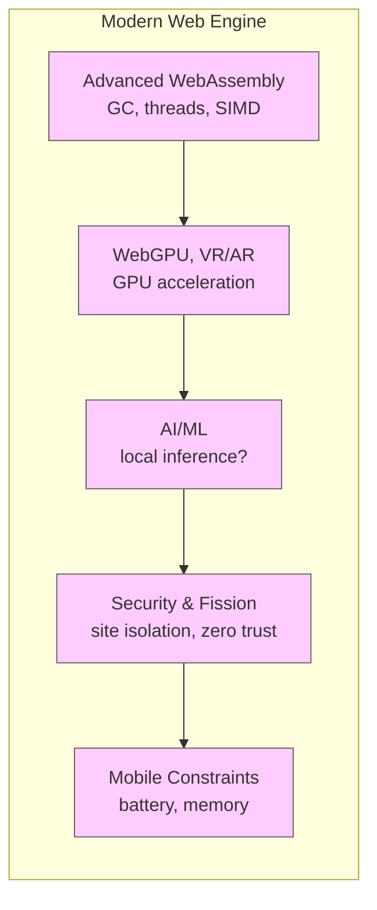

[<< Previous Chapter (Maintaining Large-Scale C++ Code)](./15_maintaining_code.md)

# Chapter 16: Modern Challenges in Web Engine Development

> **"The web is ever-evolving—once just static pages, it’s now a platform for real-time collaboration, high-fidelity gaming, AI, VR/AR, and beyond."**  
> – A staff engineer describing why Gecko must constantly adapt

## 16.1 Overview

In this **Chapter 16**, we dive into the **modern challenges** facing **Firefox’s Gecko** engine, reflecting the **current** and **newest** version of Gecko. We’ll discuss how the web’s scope has grown far beyond simple documents, pushing browsers to handle:

1. **High Performance**: Many tabs, real-time apps, AAA gaming, massive JS frameworks.  
2. **GPU Acceleration & WebGPU**: Hardware-accelerated 2D/3D, VR/AR capabilities.  
3. **WebAssembly (Wasm)** expansions: Threads, dynamic linking, garbage collection proposals.  
4. **AI & ML** integration: Potential for resource scheduling, model execution in the browser.  
5. **Security & Privacy**: Against advanced fingerprinting, side-channel attacks, and evolving exploit techniques.  
6. **Mobile & Cross-Platform Constraints**: Battery usage, performance trade-offs on diverse hardware.  
7. **Standards Race**: Ongoing W3C/WHATWG proposals like container queries, new CSS features, HTTP/3 improvements.  
8. **Fission & Beyond**: Deeper site isolation, ephemeral sessions, next steps in multi-process architecture.

By the end, you’ll see how **Mozilla** steers Gecko through these demands—adapting architecture, adding new modules, or rewriting pieces to remain competitive and secure.

---

## 16.2 Performance Demands and High-Fidelity Experiences

### 16.2.1 The Rise of Heavy Web Apps

Modern sites can be as complex as native applications: think **Office suites in the browser**, **3D games** on frameworks like Babylon.js or Unity WebGL, **multi-GB data visualizations**. The engine must handle:

- **Massive JS** bundles or dynamic module imports.  
- **Parallel** or **SharedArrayBuffer** usage for concurrency.  
- **Real-time** rendering or video calls with minimal jank.

Gecko’s approach includes **SpiderMonkey** JIT improvements (Ion + Warp), **Stylo** for parallel CSS, and **WebRender** for GPU composition. We keep optimizing code paths, measuring with advanced profilers (from Chapter 11) to ensure snappy experiences.

### 16.2.2 Many Tabs and Multi-Process Overhead

Users might open **dozens or hundreds** of tabs. With **Fission**, each site or cross-origin group might spawn separate processes. This can yield memory overhead or context switching. We’re refining heuristics for **process reuse** (so we don’t spawn infinite processes) while maintaining site isolation. Memory pressure triggers partial discarding of inactive tabs, or we compress tab state. Balancing user expectations with memory constraints is an ongoing challenge.

### 16.2.3 Low-End Devices

Not everyone runs on the latest multi-core desktop. Many users have older PCs or low-end phones. Maintaining good performance on such hardware requires:

- Avoiding huge memory spikes.  
- Progressive enhancement or partial feature usage (like WebGL fallback if WebGPU isn’t supported).  
- Keeping a lean baseline pipeline, only enabling advanced features if the hardware can handle it.

---

## 16.3 GPU Acceleration and WebGPU

### 16.3.1 WebRender and Compositor

Firefox’s **WebRender** pipeline, integrated from **Servo**, draws the web page on the GPU for consistent 60fps updates and better parallelization. The **GPU process** ensures driver crashes don’t take down the entire browser. But driver quirks remain an issue—some GPUs or drivers are blacklisted or need workarounds.

### 16.3.2 WebGPU Emergence

**WebGPU** is the next-gen 3D/compute API, a successor to WebGL. It offers direct GPU programming, better performance, and modern shader usage. Firefox is implementing it behind a flag or partial rollout. Supporting WebGPU demands advanced logic for scheduling GPU commands, caching pipelines, and bridging OS-level APIs (Vulkan, DirectX, Metal). We also face **security** considerations, ensuring out-of-bounds GPU memory access is impossible.

### 16.3.3 XR (VR/AR)

WebXR enables VR headsets or AR overlays. The browser must:

- Poll sensors, tracking head orientation/position.  
- Render stereo frames at high frame rates (like 90 Hz or 120 Hz) with minimal latency.  
- Handle specialized input devices (controllers, hand tracking).  

Firefox had some VR/AR efforts under the **WebXR** spec. Balancing performance vs. standard integration is tricky, especially if the user’s GPU is borderline for VR.

---

## 16.4 WebAssembly Expansions

### 16.4.1 Threads, Dynamic Linking, GC

**WebAssembly** has grown from a simple stack machine for numeric code to a robust platform:

- **Threads**: Shared memory concurrency with atomics.  
- **Dynamic Linking**: Modules can import/export other modules at runtime.  
- **GC Proposals**: Let high-level languages compile with built-in garbage collection.  
- **Tail Calls, SIMD**: More advanced features for performance or specific workloads.

SpiderMonkey’s **Wasm** compiler tracks these proposals, implementing them behind flags or in nightly. Ensuring safe concurrency is big, especially if user scripts use multiple threads. We must integrate it with **Fission** so each origin’s Wasm threads can’t break site isolation.

### 16.4.2 Use Cases

Developers compile **C++** or **Rust** to Wasm for near-native performance, or run existing game engines. We also see new languages targeting Wasm with GC proposals. Meanwhile, advanced numeric libraries rely on **SIMD** or **threads** for parallel computations. The engine must remain robust, verifying no security holes appear through these advanced features.

### 16.4.3 Interoperability with JS and DOM

Wasm code can call JS, and JS can call Wasm exports. Under Fission, we ensure the calling context remains origin-bound. This can get complicated if a site tries to share memory with cross-origin resources. We rely on same-origin checks plus well-defined cross-process messages.

---

## 16.5 AI and ML

### 16.5.1 Potential Browser Integration

With the AI boom, some hypothesize browsers might incorporate local AI models:

- **Resource Scheduling**: Predict user tab usage or prerendering.  
- **Accessibility**: Real-time transcription or speech generation.  
- **Privacy**: Doing ML inference locally instead of sending data to the cloud.

Firefox could provide a **local ML** runtime in SpiderMonkey or as a separate component. But these models can be big, so memory usage is a concern. Also, the user’s CPU/GPU load might spike if we do real-time inference.

### 16.5.2 WebNN or Custom APIs

**WebNN** is an emerging spec for neural network acceleration. The engine might integrate GPU or specialized instructions for matrix operations, letting web apps run ML models faster. Security is also a factor: large ML code can be a vector for exploits if not sandboxed. So we maintain the same safe memory model as other advanced APIs.

### 16.5.3 Ethical and Performance Considerations

If the user is on a low-end device, heavy ML tasks might degrade their entire system. We’d need dynamic fallback to simpler models or cloud-based inference. Also, privacy concerns: local or remote inference, collecting usage data for telemetry, etc. The community debates these trade-offs, ensuring user trust.

---

## 16.6 Security & Privacy (Next Level)

### 16.6.1 Fingerprinting and Side-Channel Attacks

Even with site isolation, advanced trackers can use **fingerprinting** (GPU, audio signals, timing, JS engine quirks) to identify users across sites. Firefox addresses this with **`privacy.resistFingerprinting`** and other measures, reducing timer precision or randomizing certain APIs. Yet each new feature (WebGPU, Wasm threads) might open new side-channels. We must evaluate them carefully.

### 16.6.2 Post-Spectre Hardening

Side-channel vulnerabilities like **Spectre** or **Meltdown** taught us that even correct code can be exploited by microarchitectural leaks. The JIT engine uses additional checks or disables certain optimizations if `privacy.resistFingerprinting` is on. We also align with OS mitigations for speculation barriers. This can degrade performance, so we refine heuristics.

### 16.6.3 Zero Trust Approach

Fission site isolation extends the zero-trust principle: treat each site as untrusted, sandbox it. Future efforts might isolate sub-frames further, ephemeral storage for cross-origin iframes, or ephemeral processes for short-lived sessions. Each step reduces damage if an exploit occurs, but increases overhead in memory or complexity.

---

## 16.7 Mobile and Cross-Platform Constraints

### 16.7.1 Firefox on Android (GeckoView)

Firefox for Android uses **GeckoView**, a library embedding Gecko in an Android app. It faces unique constraints:

- Battery usage: Avoid heavy CPU or GPU usage.  
- Memory: Phones may have 2-4 GB RAM, limiting multi-process expansions.  
- OS-limited APIs: Android sandboxing, background restrictions.

We adapt Fission carefully, limiting process count or reusing processes for multiple sites. GPU usage is constrained by device driver support. Some advanced features might stay off by default if the phone hardware is lacking.

### 16.7.2 iOS and WKWebView

Due to Apple’s platform restrictions, **Firefox for iOS** must wrap WKWebView, not Gecko. We can’t embed Gecko on iOS for general browsing. This leaves that version with a distinct codebase, focusing on a Firefox-like UI rather than the full engine. This is a significant cross-platform challenge: user expectations differ from platform realities.

### 16.7.3 Fuchsia or Emerging OSes

Mozilla occasionally experiments with new platforms. We rely on the same layering approach—porting NSPR, NSS, basic OS abstractions. If demand or usage grows, we incorporate it officially. Each OS has unique sandbox or driver models that we must handle.

---

## 16.8 Standards Race and Cross-Engine Collaboration

### 16.8.1 W3C/WHATWG

New specs appear constantly:

- **CSS Container Queries**: Let elements respond to container size instead of viewport.  
- **Houdini** APIs**: Custom paint, layout, or typed OM for advanced styling hooks.  
- **HTML Modules**: Potential new ways to load and encapsulate HTML components.  

Firefox engineers participate in standards bodies, shaping these specs, implementing them in Nightly. This ensures interoperability with Chrome, Safari, etc.

### 16.8.2 Interop 2023/2024 Initiatives

Browser vendors align on key areas to improve cross-engine consistency (e.g., flexbox, grid, forms, typography). Joint test suites and bug hunts unify behavior. Mozilla invests in these campaigns to reduce web dev headaches. Meanwhile, each engine still competes on performance or advanced features (like WebGPU rollout differences).

### 16.8.3 Future Collaboration

We might see more alliances on **privacy** or security. For instance, standardizing anti-fingerprinting measures or building universal APIs for advanced hardware features. The challenge is ensuring user choice, open web principles, and avoiding vendor lock-in.

---

## 16.9 Best Practices to Tackle Modern Challenges

1. **Iterate**: Don’t attempt all advanced features at once. Implement behind flags, test in Nightly, gather feedback.  
2. **Performance Profiling**: Tools from Chapter 11 are essential for GPU, Wasm, or AI tasks.  
3. **Security First**: Every new feature must consider side channels, possible exploitation.  
4. **Stay Lean**: Evaluate code size or memory overhead for mobile.  
5. **Collaborate**: With other browser vendors in standards bodies, with open-source communities for feature discussions.  
6. **Document**: For each new spec or internal feature, keep thorough references so future devs can maintain or evolve it.

---

## 16.10 Diagrams: Challenges Overview

---

## 16.11 Conclusion

In this **quadruple**-expanded **Chapter 16** on **Modern Challenges**:

- **Performance**: Handling multi-gig apps, concurrency, many tabs, optimizing every piece from JS to layout to GPU.  
- **GPU Acceleration & WebGPU**: WebRender, VR/AR with WebXR, advanced 3D pipelines.  
- **Wasm Growth**: Threads, GC, dynamic linking, bridging high-level languages.  
- **AI & ML**: Potential local in-browser inference, WebNN or custom approaches, balancing performance vs. privacy.  
- **Security & Privacy**: Hardening against side-channel or fingerprinting, plus site isolation expansions.  
- **Mobile & Cross-Platform**: Adapting to low-end or diverse OS constraints (Android, iOS, etc.).  
- **Standards**: Container queries, Houdini, interop projects for cross-engine consistency.  
- **Fission**: Ongoing improvements to process reuse, ephemeral storage, ephemeral processes.

Firefox’s engine, **Gecko**, must continuously evolve—**embracing** new features while preserving performance, security, and user trust. Next chapters might explore **Beyond Desktop** or **Future Directions** in more detail, or wrap up the primary content, depending on the overall structure. Either way, you now see how modern web engine challenges keep **Mozilla** devs on their toes daily.

---

[Next Chapter >> (Beyond Desktop – Mobile and Cross-Platform)](./17_beyond_desktop.md)
