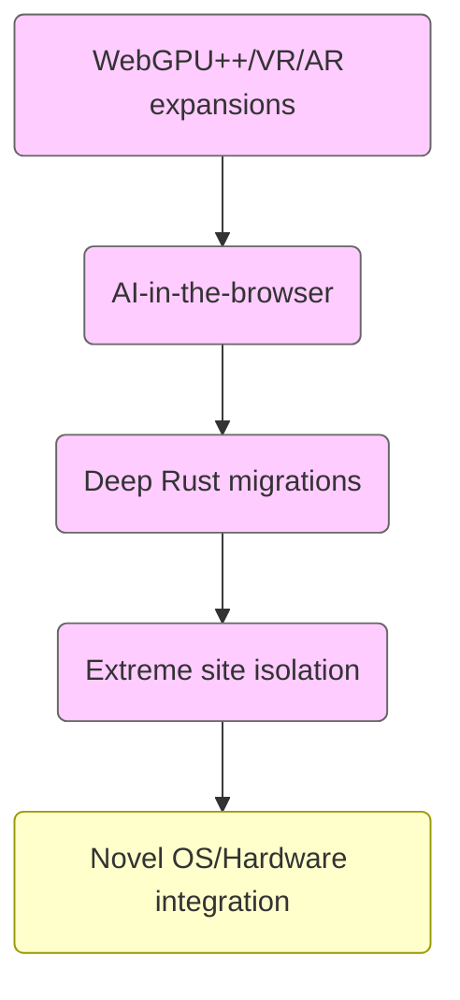

[<< Previous Chapter (Beyond Desktop – Mobile and Cross-Platform)](./17_beyond_desktop.md)

# Chapter 18: Future of Web Engines

> **"Where do we go from here? Browsers may soon integrate AI at scale, harness GPUs for everything from advanced 3D to real-time physics, and push sandboxing to new extremes—all while contending with new web specs daily."**  
> – A staff engineer anticipating the next decade of web innovation

## 18.1 Overview

This **Chapter 18** explores the **Future** of **web engines** such as Firefox’s **Gecko**, looking beyond today’s **VR/AR**, **Wasm expansions**, and **Fission** to the **next** frontiers. We’ll consider:

1. **AI-Accelerated Browsing**: Potential local or cloud-based AI, shaping resource loading, accessibility, or developer tooling.  
2. **Next-Gen Graphical Primitives**: Extending **WebGPU** for compute, global illumination, or advanced rendering.  
3. **Ultra-High Performance**: Could the engine leverage specialized hardware (FPGA, dedicated ML accelerators) or new CPU instructions?  
4. **Ephemeral, Zero-Footprint Browsing**: Possibly ephemeral processes that vanish after each site, maximum privacy.  
5. **Fully Distributed Web**: Peer-to-peer or decentralized frameworks integrated at the engine level, if standards move that direction.  
6. **Deeper Rust / Memory Safety**: Replacing more legacy C++ with Rust for less vulnerability.  
7. **Quantum-Level** concurrency or radical new OS approaches.  
8. **Speculative Ideas**: Brain-Computer interfaces, AR overlays, true offline apps with near-native performance.  
9. **Challenges**: Maintaining user trust, privacy, open web principles, all while engines morph into advanced platforms.

We’ll wrap by considering how **Firefox** might adapt to remain a leading open-source engine in an era of intense competition and continuous innovation.

---

## 18.2 AI-Accelerated Browsing

### 18.2.1 Intelligent Resource Loading

Imagine a browser that uses **ML models** to predict user flow—like which link you’ll likely click next—and preloads or prerenders that resource. This could drastically cut perceived latency. Already some sites do naive prefetching, but advanced AI might weigh factors like user history, time of day, or reading patterns.

Challenges:

- **Privacy**: Storing or transmitting user data to a model might compromise anonymity.  
- **Performance**: Running large models locally can stress CPU/GPU.  
- **Accuracy**: Wrong predictions waste bandwidth or memory.

### 18.2.2 AI-Assisted DevTools and Debugging

Developer tools might integrate AI for live suggestions or automated error detection in JS/CSS. A user’s code might get real-time refactoring proposals or best-practice alerts. Potentially, AI could watch memory usage or performance markers, offering optimization hints. Some frameworks like ChatGPT are already used for coding assistance externally, but integrated DevTools AI would be more direct and context-aware.

### 18.2.3 Accessibility Enhancements

Local ML could provide:

- **Real-time image captioning** for visually impaired users.  
- **Speech-to-text** or **text-to-speech** with advanced voices.  
- **Contextual suggestions** for site navigation.  

But these tasks are compute-intensive. We must ensure the user’s device can handle it, or consider minimal on-device models vs. cloud synergy, balancing performance and privacy.

---

## 18.3 Beyond WebGPU: Advanced Graphics and Compute

### 18.3.1 Global Illumination, Ray Tracing

If GPUs keep evolving ray-tracing hardware, we may see **WebGPU** extended to handle real-time ray tracing or global illumination for truly photorealistic scenes. Game streaming might become less necessary if the local device can do it. Gecko could add pipeline states or specialized shading modules, but must watch memory usage, driver stability, and security (like bounding resource usage so it can’t crash the GPU).

### 18.3.2 Compute Shaders

Compute tasks in **WebGPU** let devs run GPGPU algorithms, from physics simulations to AI inference. This could turn the browser into a platform for HPC (High-Performance Computing) workloads. Minimizing friction in data transfer between JS/Wasm and GPU memory is crucial. The engine’s scheduling must ensure it doesn’t starve rendering or other threads.

### 18.3.3 Mixed Reality

**VR/AR** might standardize further under **WebXR**. We could see advanced hardware like pass-through cameras or depth sensors integrated. The engine must handle real-time sensor fusion, 3D mapping. Over time, if AR glasses become mainstream, the browser’s role as an “AR content aggregator” grows. Integrating with OS-level AR frameworks or layering virtual objects in the user’s field of view requires new APIs and performance budgets.

---

## 18.4 Ultimate Security & Privacy

### 18.4.1 Per-Site Virtualization

One extreme approach to site isolation is **per-site virtualization**—like each site in a micro-VM. This ensures an exploit in site A can’t read site B’s memory. Tools like **gVisor** or **Docker**-like containers might run under the browser’s hood. That would be very resource-heavy, but feasible with future hardware or specialized OS features.

### 18.4.2 Zero-Knowledge Data

The engine might store user credentials or data in a truly ephemeral manner, never writing them unencrypted to disk. Or ephemeral site processes vanish after each session, removing all trace. Good for privacy, but might hamper convenience (like remembering session states). Balancing user desire for privacy vs. ease is a design question.

### 18.4.3 Post-Quantum Security

As quantum computers evolve, TLS and other cryptosystems must adapt. The browser might integrate **post-quantum** cryptographic algorithms (like Kyber, Dilithium) for key exchanges or signatures. We’d see new ciphers in NSS libraries, new TLS 1.3+ extension points. This must happen seamlessly so user experiences remain unaffected.

---

## 18.5 WebAssembly with Fully Native-Like Features

### 18.5.1 GC for High-Level Languages

With **Wasm GC** proposals, languages like **Java**, **C#**, or **Kotlin** could compile seamlessly to the web. The engine must integrate that with the DOM, letting high-level code manipulate the page. We might get full-blown frameworks that run natively in Wasm, replacing or supplementing JS. Security remains paramount, as miscompiled code can’t escape the sandbox.

### 18.5.2 Pluggable Runtimes?

Some propose that large apps might bring their own runtime or manager within Wasm. The engine might support modular compartments for multiple Wasm modules, each with separate GC. The engine’s role would be coordinating memory usage across these compartments to avoid thrash or security holes.

### 18.5.3 Multi-Module and Partial Instantiation

We might see multi-module linking in the browser, letting devs distribute code into separate Wasm chunks that link at runtime. This is advanced but helps keep initial load times small while enabling large codebases to scale dynamically. The engine’s job is orchestrating those link steps, verifying signatures, and ensuring same-origin or CORS compliance.

---

## 18.6 Mobile and Embedded Horizons

### 18.6.1 Future OS Paradigms

As phones converge with desktops, or new form factors (foldables, wearables) appear, the browser engine might adapt with dynamic UIs or specialized resource usage. A foldable device might have a bigger “unfolded” screen for more advanced layout. Firefox could detect that in real-time, re-flowing content seamlessly.

### 18.6.2 Edge Compute / IoT

Some see a future where **IoT** devices run minimal web engines for local dashboards or UIs. Memory constraints are huge—embedding full Gecko is tough. We might see a stripped-down build or a specialized micro-engine. If standardization moves that way, Mozilla might partner on a minimal engine form.

### 18.6.3 5G and Beyond

As networks accelerate, streaming high-res content or real-time collaboration becomes normal. The engine can fetch large assets quickly, but we must still handle offline or slow spots. The engine might do **dynamic adaptation**—caching more aggressively or switching to a lower-res mode if the user’s network weakens.

---

## 18.7 Potential AI or Brain-Computer Interface

### 18.7.1 Experimental Brain-UI

If AR/VR merges with neural interfaces, the browser could become an immersive environment where user input is partial thought or neural signals. This is extremely speculative. The engine would handle new events from BCI devices, pass them to web apps. Security is crucial—leaking neural data could be horrifying.

### 18.7.2 Ethical Concerns

Handling neural data or advanced AI in a browser raises privacy and moral questions. The engine might need strong anonymization layers or disclaimers. Could malicious pages read subtle signals from your BCI, gleaning emotional states or raw thoughts? We must ensure robust sandboxing and user control.

---

## 18.8 Deeper Rust and Memory Safety

### 18.8.1 Continued C++ to Rust Migrations

Servo’s code (WebRender, Stylo) has proven that Rust can replace large portions of engine logic safely. Over the next decade, more C++ modules—like networking or parts of layout—could be migrated to Rust. Gradually, we reduce the potential for memory corruption. The challenge is bridging large legacy code sections with modern Rust without regressions.

### 18.8.2 Full Rust-Fission?

If we get a majority of engine code in Rust, multi-process site isolation might rely less on OS-level mitigations. The memory safety from Rust plus advanced concurrency models might reduce the need for heavy sandboxing, though we still do it for malicious code. Rust also fosters easier concurrency if we design modules carefully.

### 18.8.3 Collaboration with Other Projects

We might share libraries with other open-source browsers or frameworks. The crates in **crates.io** might see broader usage beyond just Firefox, aligning security or performance across the ecosystem. Interoperability with blink-based projects might remain minimal, but some standard libraries for web specs in Rust might be shared.

---

## 18.9 Speculative OS and Concurrency Approaches

### 18.9.1 Microkernel or Non-POSIX Systems

If future OSes diverge from POSIX or adopt microkernel designs, the engine must adapt. That might be simpler if we isolate system calls behind an abstraction layer. Potentially, an engine runs in user space with minimal OS reliance, as advanced hypervisors handle resource scheduling. For now, mainstream Windows/macOS/Linux remain, but watch for new OS experiments.

### 18.9.2 Schedulable Layout / Compositing Threads

We might see a day where each DOM subtree or top-level site gets its own concurrency domain, scheduling layout tasks on available cores in a more dynamic fashion. The challenge is data races if subtrees share resources. But with advanced memory models (like Rust), partial concurrency in layout or rendering might become standard.

---

## 18.10 Best Practices for Future Readiness

1. **Stay Modular**: Don’t entangle advanced features (AI, WebGPU, Wasm expansions) with core logic. Keep them behind well-defined modules.  
2. **Behind Flags**: Enable new specs or features by default only after thorough testing. Use Nightly channels or flags for early adopters.  
3. **Security by Design**: Each new feature must consider isolation, ephemeral storage, potential side-channels.  
4. **Performance**: Use advanced profiling. Don’t let new features degrade baseline experiences.  
5. **Open Standards**: Collaborate in W3C/WHATWG. Avoid proprietary dead ends.  
6. **Community**: Engage with devs adopting these features. Early feedback is crucial to refine APIs or fix overhead.

---

## 18.11 Diagrams: Future Engine Directions

---

## 18.12 Conclusion

In this **Chapter 18** on the **Future of Web Engines**:

- **AI** might shape resource scheduling, dev tooling, accessibility, but at a cost of performance and privacy.  
- **Graphics** will push beyond **WebGPU**, possibly real-time ray tracing or advanced AR integration.  
- **WebAssembly** grows with GC, multi-module linking, letting more languages compile to the web.  
- **Security** evolves with ephemeral browsing, advanced sandboxing, post-quantum crypto, zero trust models.  
- **Mobile** constraints remain a big factor, plus potential new OS or form factors.  
- **Rust** expansions reduce memory hazards, bridging more legacy C++ modules.  
- **Speculative** areas: BCI, microkernel OS, concurrency breakthroughs.  

Firefox’s **Gecko** must adapt swiftly, balancing user privacy, open web ideals, and performance demands. Whether it’s ephemeral site processes, integrated AI, or next-gen GPU pipelines, the future of web engines is bright but complex. We close our core chapters here—any further content might highlight more specialized areas or finalize this epic journey.

---

[Next Chapter >> (Appendices – APIs, Tools, Further Reading)](./19_appendices.md)
